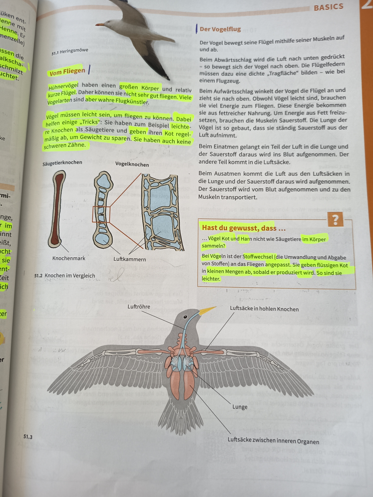

# Der Vogelflug - BASICS

## vom Fliegen

### Eigenschaften von Flugvögeln

**Hühnervögel** haben einen großen Körper und relativ kurze Flügel. Sie sind nicht sehr gut fliegen. Viele Vogelarten sind aber wahre Flugkünstler.

**Anpassungen für den Flug:**
- Vögel müssen leicht sein, um fliegen zu können
- Sie haben zum Beispiel leichte Knochen als Säugetiere und geben ihren Kot mäßig ab, um Gewicht zu sparen
- Sie haben auch keine schweren Zähne

### Knochen im Vergleich (51.2)

**Unterschied zwischen Säugetier- und Vogelknochen:**
- **Säugetierknochen**: Gefüllt mit Knochenmark (kompakte, schwere Struktur)
- **Vogelknochen**: Enthalten Luftkammern (hohle, leichte Struktur)

---

## Der Vogelflug - Mechanismus

### Flugbewegung

Der Vogel bewegt seine Flügel mithilfe seiner Muskeln auf und ab.

Beim Abwärtsschlag wird die Luft nach unten gedrückt und bewegt sich der Vogel nach oben. Dabei müssen dabei Luft und Flügel eine "Tragefläche" bilden - wie bei einem Flugzeug.

Beim Aufwärtsschlag winkelt der Vogel die Flügel an und zieht sie nach oben. Obwohl Vögel leicht sind, brauchen sie viel Energie zum Fliegen. Diese Energie bekommen sie aus fettreicher Nahrung. Um Energie aus Fett freizusetzen, brauchen die Muskeln Sauerstoff. Die Lungen der Vögel ist so gebaut, dass sie ständig Sauerstoff aus der Luft aufnimmt.

### Atmungssystem

**Sauerstoffaufnahme:**
1. Beim Einatmen gelangt ein Teil der Luft in die Lunge und der Sauerstoff daraus wird ins Blut aufgenommen
2. Der andere Teil kommt in die Luftsäcke
3. Beim Ausatmen kommt die Luft aus den Luftsäcken in die Lunge und der Sauerstoff daraus wird aufgenommen
4. Der Sauerstoff wird vom Blut aufgenommen und zu den Muskeln transportiert

### Anatomie des Vogelflugsystems (51.3)

**Hauptkomponenten:**
- **Luftröhre** (Trachea): Leitet Luft zu den Lungen
- **Lunge**: Ort des Gasaustauschs
- **Luftsäcke in hohlen Knochen**: Spezielle Luftspeicher in den hohlen Knochen
- **Luftsäcke zwischen inneren Organen**: Zusätzliche Luftreservoirs zwischen den Organen

---

## Hast du gewusst, dass...

**Stoffwechsel bei Vögeln:**
- Vögel sammeln Kot und Harn nicht wie Säugetiere im Körper
- Der Vogelkot ist der Stoffwechsel (die Umwandlung und Abgabe von Stoffen) an das Fliegen angepasst
- Sie geben ihren flüssigen Kot in kleinen Mengen ab, sobald er produziert wird
- So sind sie leichter und können besser fliegen

---

**Seitenreferenzen**: 51.2, 51.3
**Quelle**: Heringmöwe (51.1)
