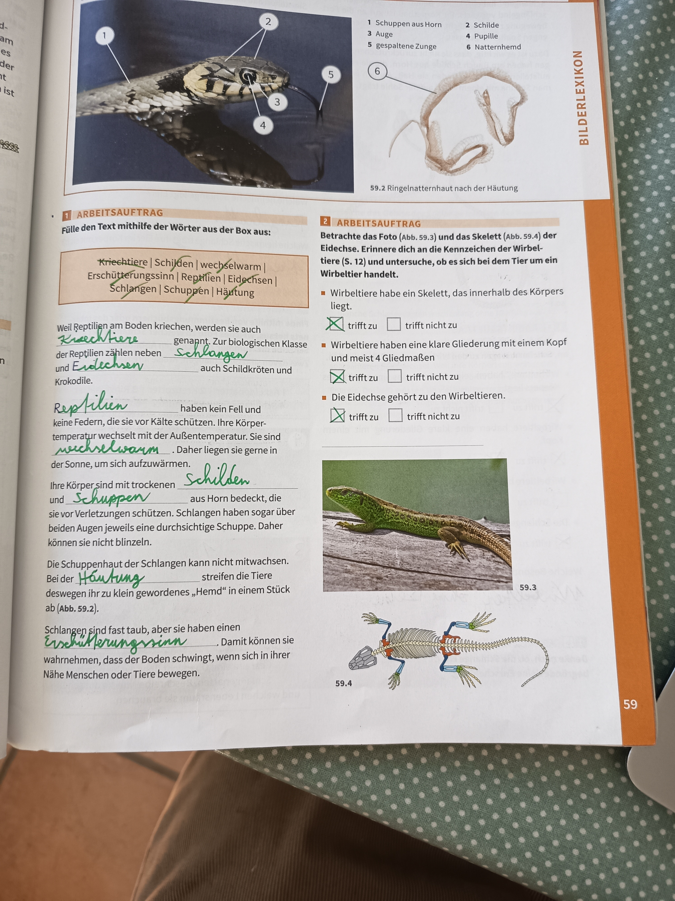

# Eidechsen und Ringelnattern - Reptilien

## Arbeitsauftrag: Fülle den Text mithilfe der Wörter aus der Box aus

**Wörter:** Kriechtiere | Schüppen | wechselwarm | Erschütterungssinn | Reptilien | Eidechsen | Schlangen | Häutung

### Lösung:

Weil **Reptilien** am Boden kriechen, werden sie auch **Kriechtiere** genannt. Zu der Biologischen Klasse der Reptilien zählen neben **Schlangen** und **Eidechsen** auch Schildkröten und Krokodile.

**Reptilien** haben kein Fell und keine Federn, die sie vor Kälte schützen. Ihre Körpertemperatur wechselt mit der Außentemperatur. Sie sind **wechselwarm**. Daher liegen sie gerne in der Sonne, um sich aufzuwärmen.

Ihre Körper sind mit trockenen **Schuppen** und **Schilden** aus Horn bedeckt, die sie vor Verletzungen schützen. Schlangen haben sogar über beiden Augen jeweils eine durchsichtige Schuppe. Daher können sie nicht blinzeln.

Die Schuppenhaut der Schlangen kann nicht mitwachsen. Bei der **Häutung** streifen die Tiere deswegen ihr zu klein gewordenes "Hemd" in einem Stück ab (Abb. 59.2).

Schlangen sind fast taub, aber sie haben einen **Erschütterungssinn**. Damit können sie wahrnehmen, dass der Boden schwingt, wenn sich in ihrer Nähe Menschen oder Tiere bewegen.

---

## Die Ringelnatter

*59.2 - Ringelnatterhaut nach der Häutung*

### Körperbau der Ringelnatter

**Körperteile:**
1. **Schwanz am Horn** - Schlitz
2. **Auge** - Pupille
3. **Gespaltene Zunge** - Rettentmündung
4. (Weitere Körperteile)
5. 
6. 

---

## Eidechsen

*59.3 - Eidechse*

### Arbeitsauftrag: Betrachte das Foto und das Skelett der Eidechse

**Aufgabe:** Erinnere dich an die Kennzeichen der Wirbeltiere (S. 4) und untersuche, ob es sich bei der Eidechse um ein Wirbeltier handelt.

#### Merkmale prüfen:

**a) Wirbeltiere haben ein Skelett, das innerhalb des Körpers liegt.**
- ✓ **trifft zu** □ trifft nicht zu

**b) Wirbeltiere haben eine klare Gliederung mit einem Kopf und meist 4 Gliedmaßen**
- ✓ **trifft zu** □ trifft nicht zu

**c) Die Eidechse gehört zu den Wirbeltieren.**
- ✓ **trifft zu** □ trifft nicht zu

### Skelett der Eidechse

*59.4 - Skelett einer Eidechse*

**Merkmale:**
- Deutlich erkennbare Wirbelsäule
- 4 Gliedmaßen (Beine)
- Inneres Skelett
- Langer Schwanz mit Wirbelknochen

---

## Zusammenfassung: Reptilien (Kriechtiere)

### Allgemeine Merkmale:

**Körperbedeckung:**
- Mit **Schuppen** und **Schildern** aus Horn bedeckt
- Keine Federn oder Fell
- Schuppen schützen vor Verletzungen
- Bei Schlangen: durchsichtige Schuppe über den Augen (können nicht blinzeln)

**Temperaturregulation:**
- **Wechselwarm** - Körpertemperatur passt sich der Umgebung an
- Liegen in der Sonne, um sich aufzuwärmen
- Können bei Kälte nicht aktiv sein

**Häutung:**
- Schuppenhaut kann nicht mitwachsen
- Regelmäßige Häutung notwendig
- Bei Schlangen: Das "Hemd" wird in einem Stück abgestreift

**Sinne:**
- Fast taub
- Besitzen **Erschütterungssinn**
- Können Bodenschwingungen wahrnehmen
- Warnung vor nahenden Menschen oder Tieren

**Zu den Reptilien gehören:**
- Schlangen (z.B. Ringelnatter)
- Eidechsen
- Schildkröten
- Krokodile

### Eidechsen als Wirbeltiere:

- **Skelett:** Innerhalb des Körpers
- **Wirbelsäule:** Deutlich erkennbar
- **Gliederung:** Kopf und 4 Gliedmaßen
- **Knochen:** Stabilisierendes inneres Skelett

---

**Seitenreferenz**: Seite 59
**Thema**: Tierkunde - Reptilien (Eidechsen und Ringelnattern)
