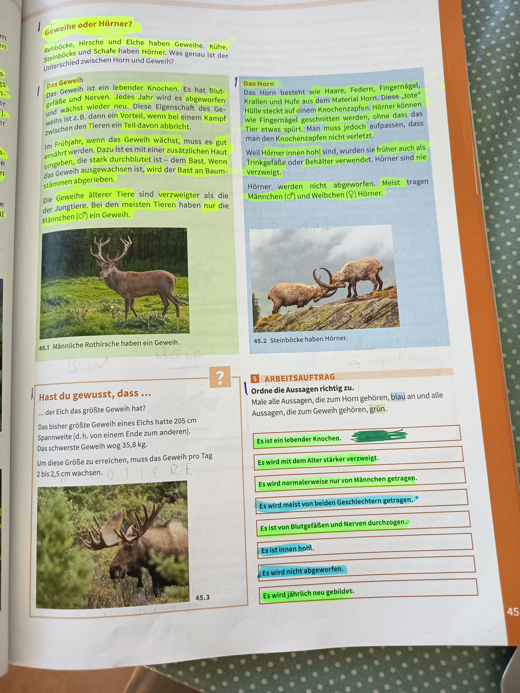

# Geweih oder Hörner?

## Unterschied zwischen Geweih und Horn

### Was ist ein Geweih?

*45.1 - Männliche Rothirsche haben ein Geweih*

**Das Geweih** ist ein lebender Knochen. Es hat Blut, Gefäße und Nerven. Jedes Jahr wird es abgeworfen und wächst wieder nach. Diese Zeit nennt man das **Verfegen**.

**Entwicklung des Geweihs:**
- Es wächst pro Tag etwa 2,5 cm
- Wenn das Geweih wächst, muss es gut ernährt werden
- Dazu ist das Geweih von einer zusätzlichen Haut umgeben, die stark durchblutet ist
- Wenn das Geweih ausgewachsen ist, wird der Bast in Baumstämmen abgerieben

**Besonderheit:**
- Im Frühjahr, wenn das Geweih wächst, muss es gut ernährt werden
- Die Geweihe älterer Tiere sind verzweigter als die der jüngeren
- Bei den meisten Tieren haben nur die **Männchen (♂)** ein Geweih

---

## Was ist ein Horn?

*45.2 - Steinböcke haben Hörner*

**Das Horn** besteht wie Haare, Federn, Fingernägel, Krallen und Hufe aus dem Material Horn. Diese "tote" Masse steckt auf einem Knochenzapfen.

**Eigenschaften von Hörnern:**
- Hörner können geschnitten werden, ohne dass das Tier verletzt wird
- Man muss jedoch aufpassen, dass man den Knochenzapfen nicht verletzt

**Besonderheit:**
- Weil Hörner innen hohl sind, wurden sie früher auch als **Trinkgefäße oder Behälter** verwendet
- Hörner sind nie verzweigt
- Hörner werden **nicht abgeworfen**
- Meist tragen Männchen (♂) und Weibchen (♀) Hörner

---

## Hast du gewusst, dass...

**Das größte Geweih:**
- Der Elch das größte Geweih hat?
- Das bisher größte Geweih eines Elchs hatte 205 cm Spannweite (d.h. von einem Ende zum anderen)
- Das schwerste Geweih wog 35,8 kg

*45.3 - Elch*

**Wachstum:**
Um diese Größe zu erreichen, muss das Geweih pro Tag 2 bis 2,5 cm wachsen.

---

## Arbeitsauftrag

### Ordne die Aussagen richtig zu:

Male alle Aussagen, die zum Horn gehören, **blau** an und alle Aussagen, die zum Geweih gehören, **grün**.

**Aussagen:**

1. ✓ **Es ist ein lebender Knochen.** (GRÜN - Geweih)

2. ✓ **Es wird mit dem Alter stärker verzweigt.** (GRÜN - Geweih)

3. ✓ **Es wird normalerweise nur von Männchen getragen.** (GRÜN - Geweih)

4. **Es wird meist von beiden Geschlechtern getragen.** (BLAU - Horn)

5. ✓ **Es ist von Blutgefäßen und Nerven durchzogen.** (GRÜN - Geweih)

6. **Es ist innen hohl.** (BLAU - Horn)

7. **Es wird nicht abgeworfen.** (BLAU - Horn)

8. ✓ **Es wird jährlich neu gebildet.** (GRÜN - Geweih)

---

## Zusammenfassung

### Geweih:
- Lebender Knochen mit Blut, Gefäßen und Nerven
- Wird jährlich abgeworfen und wächst neu
- Wird mit dem Alter verzweigter
- Normalerweise nur bei Männchen (♂)
- Beispiele: Rothirsch, Elch

### Horn:
- Besteht aus totem Hornmaterial
- Sitzt auf einem Knochenzapfen
- Innen hohl
- Wird nicht abgeworfen
- Meist bei Männchen (♂) und Weibchen (♀)
- Nie verzweigt
- Beispiele: Steinbock, Kuh, Ziege

---

**Seitenreferenz**: Seite 45
**Thema**: Tierkunde - Geweih und Hörner
