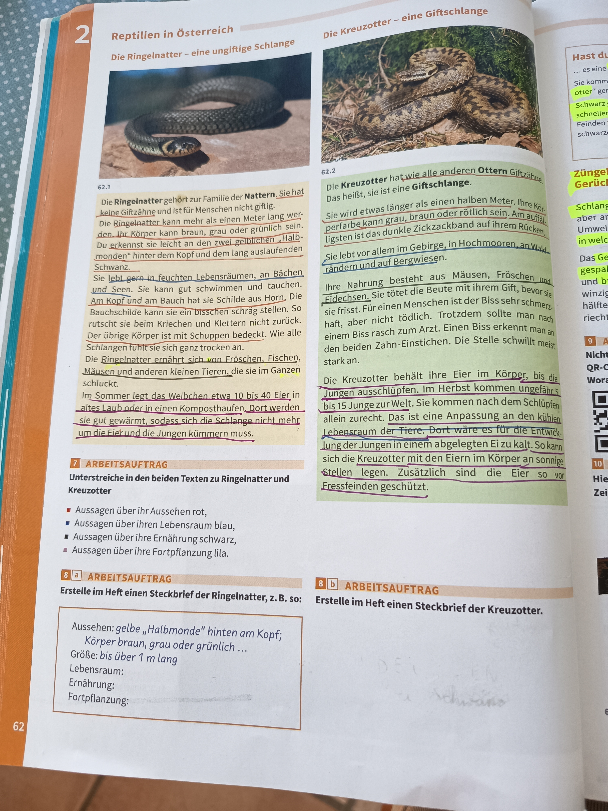

# Reptilien in Österreich

## Die Ringelnatter - eine ungiftige Schlange

*62.1 - Die Ringelnatter*

### Allgemeine Merkmale

Die **Ringelnatter** gehört zur Familie der **Nattern**. Sie hat eine eher ein-farbige Körperoberseite und ist für Menschen nicht giftig.

Die Ringelnatter kann mehr als einen Meter lang werden. Ihr Körper kann braun, grau oder grünlich sein. Sie erkennt sie leicht an den **gelben „Halbmonden"** hinter dem Kopf auslaufenden Schwanz.

### Lebensraum und Verhalten

- Sie lebt **vor allem in feuchten Lebensräumen, an Bächen und Seen**
- Sie kann gut schwimmen und tauchen
- Am Zug steht sie gern auf warmen Steinen in der Sonne. Die Bauchschilde kann sie ein bisschen schräg stellen
- So rutscht sie eine glatte Oberfläche nicht ab

### Körperbau

Der übrige Körper ist mit **Schuppen** bedeckt. Wie alle Schlangen können auch Ringelnattern ab.

### Ernährung

Die Ringelnatter ernährt sich von **Fröschen, Fischen, Kaulquappen** und von kleinen Tieren. Sie kann diese Beute lebendig schluckt.

### Fortpflanzung

Im Sommer legt das Weibchen etwa 10 bis 40 Eier in altes Laub oder in einen Komposthaufen. Dort werden sie gut gewärmt, sodass sich die Schlange nicht mehr um die Eier und die Jungen kümmern muss.

---

## Die Kreuzotter - eine Giftschlange

*62.2 - Die Kreuzotter*

### Merkmale und Erkennungszeichen

Die **Kreuzotter** hat wie alle anderen **Ottern** Giftschlange. Das heißt, sie ist eine **Giftschlange**.

Sie wird etwas länger als einen halben Meter. Ihre Körperfärbung kann **grau, braun oder rötlich** sein. Am auffallendsten ist die **Zickzackband auf ihrem Rücken**.

### Lebensraum

Sie lebt vor allem im Gebirge, in Hochmooren, an Waldrändern und warmen Wiesen.

### Ernährung

Ihre Nahrung besteht aus **Mäusen, Fröschen und Eidechsen**. Sie tötet die Beute mit ihrem Gift, bevor sie sie frisst. Für den Menschen ist ein Biss sehr schmerzhaft, aber nicht tödlich. Trotzdem sollte man nach einem Biss rasch zum Arzt. Man erkennt man halt, dass es der Stich einer beiden Arten Einstechen. Die Stelle schwillt meist stark an.

### Fortpflanzung und Entwicklung

Die Kreuzotter behält ihre Eier im Körper. Die Jungen ausschlüpfen daher erst im Herbst kommen ungefähr bis 15 Junge zur Welt. Sie kommen nach dem Schlüpfen allein zurecht. Das ist eine Anpassung an den kühlen Lebensraum der Tiere. Dort wäre es für die Entwicklung der Jungen in einem abgelegten Ei zu kalt. So kann sich die Kreuzotter mit den Eltern im Körper an sonnige Stellen legen. Zusätzlich sind die Eier so von Fressfeinden geschützt.

---

## Hast du gewusst, dass...

**Züngelgeruch:**
- Schlangen können mit ihrer Zunge Gerüche „erschnüffeln"
- Die Zunge nimmt Duftstoffe aus der Umwelt auf
- Das Geruchsorgan wird dann „gespurt" und winzige Geruchshälftig übertragen erreichen

---

## Arbeitsaufträge

### Arbeitsauftrag 1
**Unterstreiche in den beiden Texten zu Ringelnatter und Kreuzotter:**
- Aussagen über ihr Aussehen rot
- Aussagen über ihren Lebensraum blau
- Aussagen über ihre Ernährung schwarz
- Aussagen über ihre Fortpflanzung lila

### Arbeitsauftrag 2 (7/E)
**Erstelle im Heft einen Steckbrief der Ringelnatter, z. B. so:**

- **Aussehen**: gelbe "Halbmonde" hinten am Kopf; Körper braun, grau oder grünlich ...
- **Größe**: bis über 1 m lang
- **Lebensraum**: _________
- **Ernährung**: _________
- **Fortpflanzung**: _________

### Arbeitsauftrag 3 (8/D)
**Erstelle im Heft einen Steckbrief der Kreuzotter.**

---

**Seitenreferenz**: Seite 62
