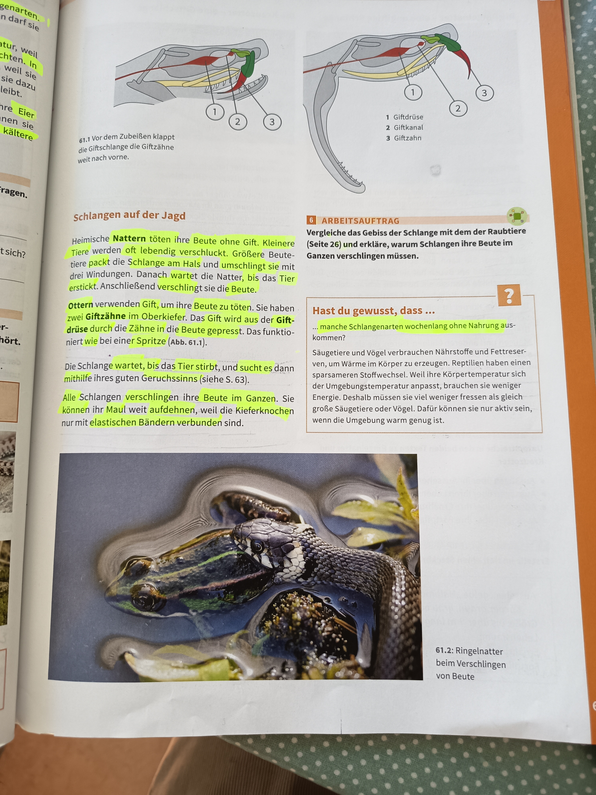

# Schlangen auf der Jagd

## Giftzähne der Giftschlange

*61.1 - Von den Zähnen klappt die Giftschlange die Giftzähne weit nach vorne*

**Aufbau der Giftzähne:**
1. **Giftdrüse** - Produziert das Gift
2. **Giftkanal** - Leitet das Gift zum Zahn
3. **Giftzahn** - Hohler Zahn zum Injizieren des Gifts

---

## Schlangen auf der Jagd - Jagdmethoden

### Nattern (ungiftig)

**Nattern** töten ihre Beute ohne Gift. 

**Jagdmethode:**
- Kleinere Tiere werden von der Natter gepackt und verschluckt
- Größere Beutetiere: Die Schlange packt das Beutetier am Hals und umschlingt es mit drei Windungen
- Danach wartet die Natter, bis das Tier erstickt
- Anschließend verschlingt sie die Beute

### Ottern (giftig)

**Ottern** verwenden Gift, um ihre Beute zu töten.

**Jagdmethode:**
- Sie haben zwei **Giftzähne** im Oberkiefer
- Die Giftzähne sind wie zwei Kanäle mit einer **Giftdrüse** verbunden
- Das Gift wird durch die Zähne in die Beute gepresst
- Das funktioniert bei Beute sehr gut (Abb. 61.1)

**Besonderheit:**
Die Schlange wartet, bis das Tier stirbt, und sucht es dann mithilfe ihres guten Geruchssinns (siehe S. 63).

---

## Wie Schlangen ihre Beute verschlingen

*61.2 - Ringelnatter beim Verschlingen von Beute*

**Der Verschlingungsprozess:**

Alle Schlangen verschlingen ihre Beute im Ganzen. Sie können ihr Maul weit öffnen, weil die Kieferknochen nur mit elastischen Bändern verbunden sind.

**Schritte:**
1. Die Schlange öffnet ihr Maul sehr weit
2. Die Kieferknochen sind nur mit elastischen Bändern verbunden
3. Die Beute wird im Ganzen verschluckt
4. Der Kiefer kann sich extrem weit dehnen

---

## Arbeitsauftrag

**Vergleiche das Gebiss der Schlange mit dem der Raubtiere (Seite 26) und erkläre, warum Schlangen ihre Beute im Ganzen verschlingen müssen.**

### Antwort:

**Unterschiede zwischen Schlangen und Raubtieren:**

**Raubtiere (z.B. Hund, Katze):**
- Haben verschiedene Zahntypen: Schneidezähne, Eckzähne, Backenzähne
- Können Fleisch zerreißen und kauen
- Haben kräftige Kaumuskeln
- Können Nahrung zerkleinern

**Schlangen:**
- Haben keine Zähne zum Kauen
- Giftzähne dienen nur zum Töten (bei Ottern)
- Können Nahrung nicht zerkleinern
- Müssen Beute im Ganzen verschlingen

**Warum Schlangen ihre Beute ganz verschlingen:**
Schlangen haben keine Backenzähne zum Kauen. Ihre Zähne sind nur zum Festhalten und (bei Giftschlangen) zum Injizieren von Gift geeignet. Deshalb können sie ihre Beute nicht zerkleinern und müssen sie im Ganzen verschlucken. Die elastischen Bänder zwischen den Kieferknochen ermöglichen es ihnen, ihr Maul extrem weit zu öffnen.

---

## Hast du gewusst, dass...

**Schlangen wochenlang ohne Nahrung auskommen können?**

Säugetiere und Vögel verbrauchen Nährstoffe und Fettreserven, um Wärme im Körper zu erzeugen. Reptilien haben einen sparsameren Stoffwechsel. Weil ihre Körpertemperatur sich der Umgebungstemperatur anpasst, brauchen sie weniger Energie. Deshalb müssen sie viel weniger fressen als gleich große Säugetiere oder Vögel. Dafür können sie nur aktiv sein, wenn die Umgebung warm genug ist.

**Wichtige Fakten:**
- Schlangen können **wochenlang ohne Nahrung** auskommen
- Sie haben einen **sparsameren Stoffwechsel** als Säugetiere und Vögel
- Sie brauchen weniger Energie, da sie **wechselwarm** sind
- Sie müssen viel weniger fressen als gleich große Säugetiere oder Vögel
- Nachteil: Sie können nur aktiv sein, wenn die Umgebung warm genug ist

---

## Zusammenfassung: Schlangen auf der Jagd

### Jagdmethoden:

**Nattern (ungiftig):**
- Töten Beute ohne Gift
- Kleine Tiere: Packen und verschlucken
- Große Tiere: Umschlingen mit drei Windungen und ersticken
- Warten bis das Tier tot ist
- Dann verschlingen

**Ottern (giftig):**
- Haben zwei Giftzähne im Oberkiefer
- Giftzähne sind mit Giftdrüse verbunden
- Gift wird durch die Zähne in die Beute gepresst
- Warten bis das Tier stirbt
- Suchen die Beute mit Geruchssinn
- Dann verschlingen

### Verschlingen der Beute:

- Alle Schlangen verschlingen Beute im Ganzen
- Kieferknochen sind nur mit elastischen Bändern verbunden
- Maul kann sehr weit aufgehen
- Keine Backenzähne zum Kauen vorhanden

### Stoffwechsel:

- Wechselwarme Tiere
- Sparsamerer Stoffwechsel als Säugetiere/Vögel
- Können wochenlang ohne Nahrung auskommen
- Brauchen weniger Energie
- Nur aktiv bei warmer Umgebung

---

**Seitenreferenz**: Seite 61
**Thema**: Tierkunde - Schlangen auf der Jagd
