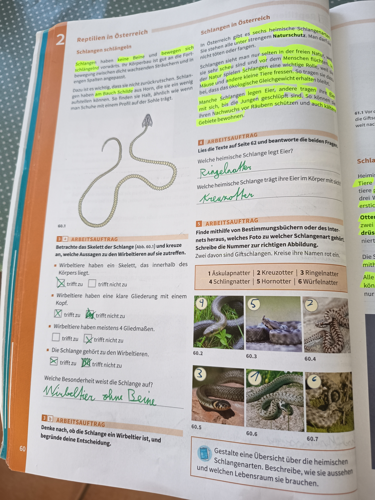

# Reptilien in Österreich - Schlangen

## Schlangen schlängeln

**Wichtige Fakten über Schlangen:**

Schlangen haben keine Beine und bewegen sich schlängelnd fort. Sie passen sich gut an die Fortbewegung zwischen dicht wachsenden Gräsern und Pflanzen an.

Es ist wichtig, dass man nicht zurückweicht, wenn man ihnen begegnet. Sie greifen nicht an. Man sollte Schuhe mit hohem Profil tragen, die Schutz bieten.

---

## Arbeitsauftrag: Skelett der Schlange

*60.1 - Skelett einer Schlange*

### Betrachte das Skelett der Schlange (Abb. 60.1) und kreuze an, welche Aussagen zu den Wirbeltieren auf sie zutreffen.

**Wirbeltiere haben ein Skelett, das innerhalb des Körpers liegt:**
- ✓ **trifft zu** ☐ trifft nicht zu

**Wirbeltiere haben eine klare Gliederung mit einem Kopf:**
- ✓ **trifft zu** ☐ trifft nicht zu

**Wirbeltiere haben meistens 4 Gliedmaßen:**
- ☐ trifft zu ✓ **trifft nicht zu**

**Die Schlange gehört zu den Wirbeltieren:**
- ✓ **trifft zu** ☐ trifft nicht zu

### Welche Besonderheit weist die Schlange auf?

**Antwort:** Wirbeltier ohne Beine

---

## Arbeitsauftrag: Ist die Schlange ein Wirbeltier?

**Denke nach, ob die Schlange ein Wirbeltier ist, und begründe deine Entscheidung.**

**Antwort:**
Ja, die Schlange ist ein Wirbeltier, weil sie:
- Ein inneres Skelett hat
- Eine deutliche Wirbelsäule besitzt
- Einen klaren Kopf hat
- Zu den Reptilien gehört

**Besonderheit:** Schlangen sind Wirbeltiere ohne Gliedmaßen (Beine).

---

## Schlangen in Österreich

### Naturschutz

In Österreich gibt es **sechs heimische Schlangenarten**. Sie stehen alle unter strengem **Naturschutz**. Man darf sie nicht töten oder stören.

**Wichtige Regeln:**
- Schlangen sieht man nur selten in der freien Natur
- Sie sind sehr scheu und flüchten vor dem Menschen
- Sie fressen kleine Tiere (Mäuse, Frösche) - eine wichtige Rolle im ökologischen Gleichgewicht
- Manche Schlangenarten legen Eier, andere tragen lebende Jungen

---

## Arbeitsauftrag: Bestimmung heimischer Schlangen

### A) Lies die Info auf Seite 62 und beantworte die beiden Fragen:

**Welche heimische Schlange legt Eier?**
- **Antwort:** Ringelnatter

**Welche heimische Schlange trägt ihre Eier im Körper mit sich?**
- **Antwort:** Kreuzotter

---

### B) Finde mithilfe von Bestimmungsbüchern oder des Internets heraus, welches Foto zu welcher Schlangenart gehört.

Schreibe die Nummer zur richtigen Abbildung. Zwei davon sind Giftschlangen. Kreise ihre Namen rot ein.

*60.2 - 60.7 - Sechs heimische Schlangenarten*

**Die 6 heimischen Schlangenarten:**

1. **Äskulapnatter** - Bild 1 (60.2)
2. **Kreuzotter** - Bild 2 (60.3) 🔴 **GIFTIG**
3. **Ringelnatter** - Bild 3 (60.4)
4. **Schlingnatter** - Bild 4 (60.5)
5. **Hornotter** - Bild 5 (60.6) 🔴 **GIFTIG**
6. **Würfelnatter** - Bild 6 (60.7)

---

## Zusammenfassung: Heimische Schlangen

### Merkmale aller Schlangen:

**Körperbau:**
- Keine Beine - schlängelnde Fortbewegung
- Inneres Skelett mit Wirbelsäule
- Wirbeltiere ohne Gliedmaßen
- Klarer Kopf

**Verhalten:**
- Sehr scheu
- Flüchten vor Menschen
- Greifen nicht an
- Wichtig für ökologisches Gleichgewicht

**Fortpflanzung:**
- Einige legen Eier (z.B. Ringelnatter)
- Andere tragen Eier im Körper (z.B. Kreuzotter)

### Giftschlangen in Österreich:

**2 von 6 Arten sind giftig:**
1. **Kreuzotter**
2. **Hornotter**

**Schutz:**
- Alle 6 Arten stehen unter strengem Naturschutz
- Nicht töten oder stören
- Bei Begegnungen: Nicht zurückweichen, Schlangen flüchten selbst

---

## Aufgabe: Gestalte eine Übersicht

**Gestalte eine Übersicht über die heimischen Schlangenarten. Beschreibe, wie sie aussehen und welchen Lebensraum sie brauchen.**

### Die 6 heimischen Schlangenarten:

**1. Äskulapnatter** (ungiftig)
- Lebensraum: Warme Gebiete, Weinberge, Steinmauern
- Aussehen: Gelblich bis olivgrün

**2. Kreuzotter** (giftig)
- Lebensraum: Moorgebiete, Waldränder, Gebirge
- Aussehen: Zickzack-Muster auf dem Rücken

**3. Ringelnatter** (ungiftig)
- Lebensraum: Feuchtgebiete, Gewässer
- Aussehen: Gelbe oder weiße Mondflecken hinter dem Kopf

**4. Schlingnatter** (ungiftig)
- Lebensraum: Trockene, steinige Gebiete
- Aussehen: Braun-grau mit dunklen Flecken

**5. Hornotter** (giftig)
- Lebensraum: Gebirge, alpine Regionen
- Aussehen: Ähnlich wie Kreuzotter, kleines Horn auf der Nase

**6. Würfelnatter** (ungiftig)
- Lebensraum: Fließgewässer, Flüsse
- Aussehen: Würfelmuster auf dem Rücken

---

**Seitenreferenz**: Seite 60-61
**Thema**: Tierkunde - Reptilien in Österreich (Schlangen)
