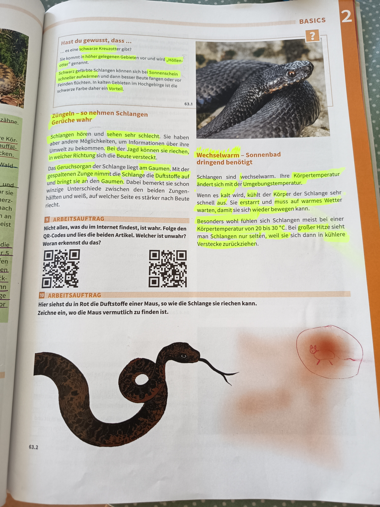

# Schlangen - Sinne und Thermoregulation

## Hast du gewusst, dass...

**Die schwarze Kreuzotter:**
- Es eine schwarze Kreuzotter gibt?
- Sie kommt in höher gelegenen Gebieten vor und wird „Höllenotter" genannt
- Schwarze Schlangen können sich bei Sonnenschein schneller aufwärmen und dann besser bewegen oder vor Feinden fliehen
- Im Hochgebirge ist die schwarze Farbe daher nützlicher

*63.1 - Kreuzotter*

---

## Züngeln - so nehmen Schlangen Gerüche wahr

### Das Geruchssystem

Schlangen hören und sehen sehr schlecht. Sie haben aber andere Möglichkeiten, um Informationen über ihre Umwelt zu bekommen. Bei der Jagd können sie riechen, in welcher Richtung sich die Beute versteckt.

### Wie funktioniert das Geruchsorgan?

Das **Geruchsorgan** der Schlange liegt am Gaumen. Mit der gespaltenen Zunge nimmt die Schlange die Duftstoffe auf und bringt sie an den Gaumen. Dabei bemerkt sie schon winzige Unterschiede der Duftstoffe auf beiden Zungenspitzen. Das hilft ihr zu erkennen, auf welcher Seite es stärker nach Beute riecht.

*63.2 - Illustration: Schlange verfolgt Mausspur mit Hilfe ihrer gespaltenen Zunge*

**Darstellung:**
- Links: Schlange mit gespaltener Zunge
- Rechts: Maus mit Duftspuren (rot markiert)
- Die Schlange nutzt ihre Zunge, um die Duftspur der Maus zu verfolgen

---

## Wechselwarm - Sonnenbad dringend benötigt

### Was bedeutet wechselwarm?

Schlangen sind **wechselwarm**. Ihre **Körpertemperatur** ändert sich mit der Umgebungstemperatur.

Wenn es kalt wird, kühlt der Körper der Schlange sehr schnell ab. Sie erstarrt und muss auf warmes Wetter warten, damit sie sich wieder bewegen kann.

### Thermoregulation durch Verhalten

Besonders wohl fühlen sich Schlangen meist bei einer Körpertemperatur von 20 bis 30 °C. Bei großer Hitze sieht man Schlangen nur selten, weil sie sich dann in kühlere Verstecke zurückziehen.

**Anpassung:**
- Schlangen suchen aktiv Sonnenplätze auf, um sich aufzuwärmen
- Bei zu großer Hitze ziehen sie sich in kühlere Verstecke zurück
- Sie können ihre Körpertemperatur nicht selbst regulieren wie Säugetiere

---

## Arbeitsaufträge

### Arbeitsauftrag 9
**Nicht alles, was du im Internet findest, ist wahr. Folge den QR-Codes und lies die beiden Artikel. Welcher ist unwahr? Woran erkennst du das?**

[QR-Code 1] [QR-Code 2]

### Arbeitsauftrag 10
**Hier siehst du in Rot die Duftstoffe einer Maus, so wie die Schlange sie riechen kann. Zeichne ein, wo die Maus vermutlich zu finden ist.**

---

## Zusammenfassung

**Sinnesorgane der Schlangen:**
- **Sehen und Hören**: Sehr schlecht entwickelt
- **Geruchssinn**: Hoch entwickelt mit gespaltener Zunge und Geruchsorgan am Gaumen
- **Züngeln**: Aufnahme von Duftstoffen aus der Umgebung

**Thermoregulation:**
- **Wechselwarm**: Körpertemperatur abhängig von Umgebungstemperatur
- **Optimum**: 20-30 °C Körpertemperatur
- **Verhalten**: Aktives Aufsuchen von Sonnenplätzen oder kühlen Verstecken

**Anpassungen:**
- Schwarze Färbung in höheren Lagen (bessere Wärmeaufnahme)
- Gespaltene Zunge für präzises Orten von Beute
- Verhaltensbasierte Temperaturregulation

---

**Seitenreferenz**: Seite 63
**Thema**: BASICS - Reptilien/Schlangen
