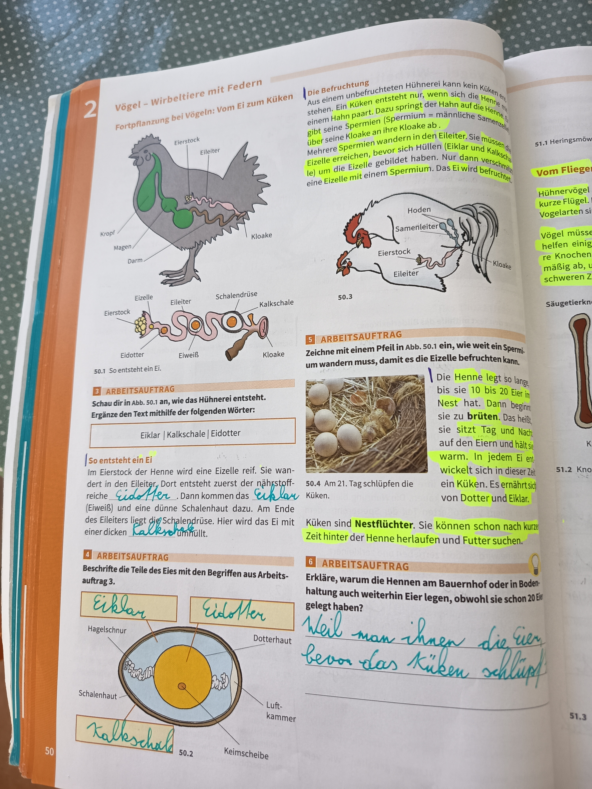

# Vögel - Wirbeltiere mit Federn

## Fortpflanzung bei Vögeln: Vom Ei zum Küken

### Befruchtung

Ohne Befruchtung beim Hühnerei kann kein Küken entstehen. Die Eizelle der Henne muss sich mit einer männlichen Samenzelle eines Hahns paaren. Dazu springt der Hahn auf die Henne und berührt mit seiner Kloake ihre Kloake. Männchen nennt man auch Hähne.

Die Eizelle wandert in den Eileiter. Sie muss befruchtet werden, bevor sie ihre Hüllen (Eiklar und Schale) erhält.

Wenn die Eizelle befruchtet wurde, bildet sich ein Embryo. Nur befruchtete Eier entwickeln sich zu Küken.

---

## Arbeitsauftrag: Wie das Hühnerei entsteht

*50.1 - So sieht ein Ei aus*

**Aufgabe:** Schau dir in Abb. 50.1 an, wie das Hühnerei entsteht. Ergänze den Text mithilfe der folgenden Wörter:

**Wörter:** Eiklar | Kalkschale | Eidotter

### Lösung:

**So entsteht ein Ei:**

Im Eierstock der Henne wird eine Eizelle reif. Sie wandert in den Eileiter. Dort entsteht zuerst der nährstoffreiche **Eidotter**. Dann kommen das **Eiklar** (Eiweiß) und eine dünne Schalenhaut hinzu. Am Ende des Eierleiters liegt die Schleimdrüse. Hier wird das Ei mit einer dicken **Kalkschale** versehen.

---

## Arbeitsauftrag: Beschrifte die Teile des Eies

*50.2 - Aufbau eines Hühnereies*

**Teile eines Eies:**

1. **Hagelschnur** - Hält den Dotter in der Mitte
2. **Dotterhaut** - Umhüllt den Dotter
3. **Schalenhaut** - Schützt das Ei von innen
4. **Luftkammer** - Luftraum zwischen den Schalenhäuten
5. **Keimscheibe** - Aus ihr entwickelt sich das Küken
6. **Kalkschale** - Harte äußere Schale

---

## Fortpflanzung: Vom Ei zum Küken

*50.4 - Am 21. Tag schlüpfen die Küken*

### Der Brutprozess

**Die Henne legt so lange Eier, bis sie 10 bis 20 Eier im Nest hat. Dann beginnt sie zu brüten.**

Das heißt, sie **sitzt** Tag und Nacht auf den Eiern und hält sie **warm**. In jedem Ei entwickelt sich in dieser Zeit ein **Küken**. Es ernährt sich von **Dotter** und **Eiklar**.

**Brutdauer:** Am **21. Tag** schlüpfen die Küken.

---

## Küken sind Nestflüchter

**Küken sind Nestflüchter.** Sie können schon nach kurzer Zeit hinter der Henne herlaufen und **Futter suchen**.

### Eigenschaften von Nestflüchtern:

- Können kurz nach dem Schlüpfen laufen
- Folgen der Mutter
- Suchen selbstständig nach Futter
- Sind sofort aktiv
- Haben Daunenfedern

---

## Arbeitsauftrag: Hennen am Bauernhof oder in Bodenhaltung

**Erkläre, warum die Hennen am Bauernhof oder in Bodenhaltung auch weiterhin Eier legen, obwohl sie schon 20 Eier gelegt haben.**

### Antwort:

**Weil man ihnen die Eier weg nimmt.**

Die Hennen legen normalerweise 10-20 Eier und beginnen dann zu brüten. Wenn man die Eier aber regelmäßig aus dem Nest nimmt, erreicht die Henne nie die "volle" Anzahl von Eiern und legt deshalb immer weiter Eier nach. So können Hühner in der Landwirtschaft kontinuierlich Eier produzieren.

---

## Körperbau des Huhns

*50.1 - Körperteile eines Huhns*

**Wichtige Körperteile:**

1. **Kopf** - Mit Schnabel und Kamm
2. **Kamm** - Roter Hautlappen auf dem Kopf
3. **Schnabel** - Zum Picken und Fressen
4. **Kehllappen** - Rote Hautlappen unter dem Schnabel
5. **Hals** - Verbindet Kopf und Körper
6. **Flügel** - Zum (kurzen) Fliegen
7. **Federn** - Bedecken den ganzen Körper
8. **Brust** - Vorderer Körperteil
9. **Bauch** - Unterer Körperteil
10. **Kloake** - Ausgang für Eier und Ausscheidungen
11. **Schwanz/Schwanzfedern** - Hinterteil mit langen Federn
12. **Schenkel** - Oberer Teil der Beine
13. **Bein** - Zum Laufen und Scharren
14. **Kralle** - An den Zehen
15. **Zehen** - Am Ende der Beine

---

## Zusammenfassung: Vögel und Fortpflanzung

### Merkmale von Vögeln:

- **Wirbeltiere mit Federn**
- Haben einen Schnabel
- Legen Eier
- Haben Flügel
- Die meisten können fliegen

### Fortpflanzung:

**Befruchtung:**
- Hahn und Henne paaren sich
- Kloake des Hahns berührt Kloake der Henne
- Samenzelle befruchtet Eizelle

**Ei-Entstehung:**
1. Eizelle im Eierstock
2. Wandert in Eileiter
3. Eidotter entsteht (nährstoffreich)
4. Eiklar (Eiweiß) wird hinzugefügt
5. Schalenhaut entsteht
6. Kalkschale wird gebildet

**Bruten:**
- Henne legt 10-20 Eier
- Sitzt 21 Tage auf den Eiern
- Hält sie warm
- Küken entwickeln sich im Ei

**Nestflüchter:**
- Küken können sofort laufen
- Suchen selbst Futter
- Folgen der Mutter

### Aufbau des Eies:

- **Kalkschale** - Schutz von außen
- **Schalenhaut** - Schutz von innen
- **Luftkammer** - Für Atmung
- **Eiklar (Eiweiß)** - Nahrung und Schutz
- **Dotterhaut** - Umhüllt den Dotter
- **Eidotter** - Hauptnahrung für Embryo
- **Keimscheibe** - Entwickelt sich zum Küken
- **Hagelschnur** - Hält Dotter in Position

---

**Seitenreferenz**: Seite 50-51
**Thema**: Tierkunde - Vögel und Fortpflanzung
