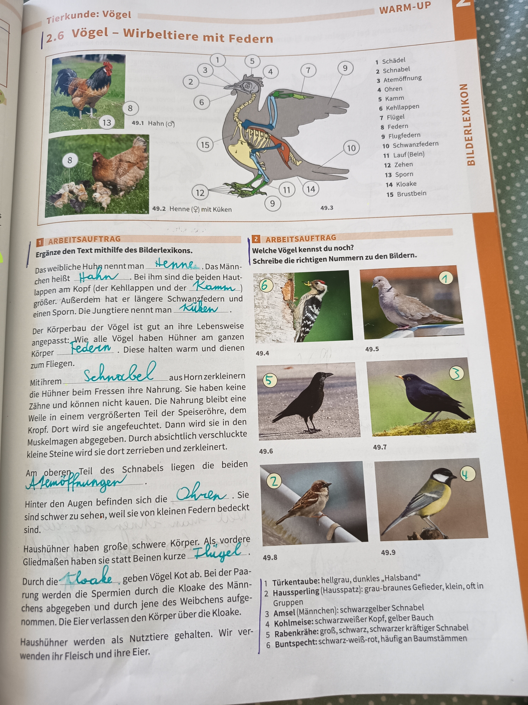

# Vögel - Wirbeltiere mit Federn

## 2.6 Vögel - Wirbeltiere mit Federn

### Hühner als Beispiel

*49.1 Hahn (♂) und 49.2 Henne (♀) mit Küken*

**Weibliche und männliche Hühner:**
- Das weibliche Tier heißt **Henne**, das Männchen heißt **Hahn**
- Beim Hahn sind die beiden Hautlappen am Kopf (der Kehllappen und der Kamm) größer
- Außerdem hat er längere Schwanzfedern und einen Sporn
- Die Jungtiere nennt man **Küken**

### Körperbau der Vögel

**Körperteile (nummeriert):**
1. Schädel
2. Schnabel
3. Atemöffnung
4. Ohren
5. Kamm
6. Kehllappen
7. Flügel
8. Federn
9. Flugfedern
10. Schwanzfedern
11. Lauf (Bein)
12. Zehen
13. Sporn
14. Kloake
15. Brustbein

**Anpassung an die Lebensweise:**

Der Körperbau der Vögel ist gut an ihre Lebensweise angepasst. Alle Vögel haben **Federn** am ganzen Körper. Diese halten warm und dienen zum Fliegen.

**Schnabel:**
Mit ihrem **Schnabel** aus Horn zerkleinern die Hühner beim Fressen ihre Nahrung. Sie haben keine Zähne und können nicht kauen. Die Nahrung bleibt eine Weile in einem vergrößerten Teil der Speiseröhre, dem **Kropf**. Dort wird sie angefeuchtet. Dann wird sie in den **Muskelmagen** weitergegeben. Absichtlich verschluckte kleine Steine werden dort zerrieben und zerkleinert.

**Atemöffnungen:**
Am oberen Teil des Schnabels liegen die beiden **Atemöffnungen**.

**Ohren:**
Hinter den Augen befinden sich die **Ohren**. Sie sind schwer zu sehen, weil sie von kleinen Federn bedeckt sind.

**Flügel:**
Haushühner haben große schwere Körper. Als vordere Gliedmaßen haben sie statt Beinen kurze **Flügel**.

**Kloake:**
Durch die **Kloake** geben Vögel Kot ab. Bei der Paarung werden die Spermien durch die Kloake des Männchens abgegeben und durch jene des Weibchens aufgenommen. Die Eier verlassen den Körper über die Kloake.

**Nutzung:**
Haushühner werden als Nutztiere gehalten. Wir verwenden ihr Fleisch und ihre Eier.

---

## Welche Vögel kennst du noch?

Schreibe die richtigen Nummern zu den Bildern.

### Vogelarten (Bilder 49.4 - 49.9):

**1. Türkentaube:** hellgrau, dunkles „Halsband"
- *49.4 - Türkentaube*

**2. Haussperling (Spatz):** grau-braunes Gefieder, klein, oft in Gruppen
- *49.5 - Haussperling (Spatz)*

**3. Amsel (Männchen):** schwarzgelber Schnabel
- *49.6 - Amsel (Männchen)*

**4. Kohlmeise:** schwarzweißer Kopf, gelber Bauch
- *49.7 - Kohlmeise*

**5. Rabenkrähe:** groß, schwarz, schwarzer kräftiger Schnabel
- *49.8 - Rabenkrähe*

**6. Buntspecht:** schwarz-weiß-rot, häufig an Baumstämmen
- *49.9 - Buntspecht*

---

## Arbeitsaufträge

### Arbeitsauftrag 1
**Ergänze den Text mithilfe des Bilderlexikons.**

Das weibliche Tier heißt **Henne**, das Männchen heißt **Hahn**. Beim Hahn sind die beiden Hautlappen am Kopf (der Kehllappen und der **Kamm**) größer. Außerdem hat er längere Schwanzfedern und einen Sporn. Die Jungtiere nennt man **Küken**.

Der Körperbau der Vögel ist gut an ihre Lebensweise angepasst. Alle Vögel haben **Federn** am ganzen Körper. Diese halten warm und dienen zum Fliegen.

Mit ihrem **Schnabel** aus Horn zerkleinern die Hühner beim Fressen ihre Nahrung. Sie haben keine Zähne und können nicht kauen. Die Nahrung bleibt eine Weile in einem vergrößerten Teil der Speiseröhre, dem Kropf. Dort wird sie angefeuchtet. Dann wird sie in den Muskelmagen weitergegeben. Absichtlich verschluckte kleine Steine werden dort zerrieben und zerkleinert.

Am oberen Teil des Schnabels liegen die beiden **Atemöffnungen**.

Hinter den Augen befinden sich die **Ohren**. Sie sind schwer zu sehen, weil sie von kleinen Federn bedeckt sind.

Haushühner haben große schwere Körper. Als vordere Gliedmaßen haben sie statt Beinen kurze **Flügel**.

Durch die **Kloake** geben Vögel Kot ab. Bei der Paarung werden die Spermien durch die Kloake des Männchens abgegeben und durch jene des Weibchens aufgenommen. Die Eier verlassen den Körper über die Kloake.

Haushühner werden als Nutztiere gehalten. Wir verwenden ihr Fleisch und ihre Eier.

### Arbeitsauftrag 2
**Welche Vögel kennst du noch?**

Schreibe die richtigen Nummern zu den Bildern:
1. Türkentaube
2. Haussperling (Spatz)
3. Amsel (Männchen)
4. Kohlmeise
5. Rabenkrähe
6. Buntspecht

---

**Seitenreferenz**: Seite 49
**Thema**: Tierkunde: Vögel
**Kategorie**: WARM-UP / BILDER LEXIKON
