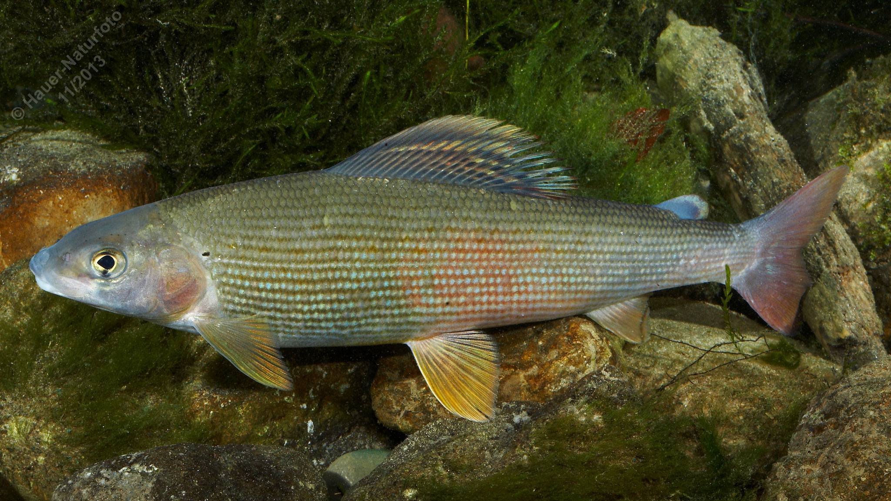

# Äsche

**Lateinischer Name:** *Thymallus thymallus*

## Allgemeine Informationen

### Schonzeit
1. März bis 30. April

### Brittelmaß
30 cm

## Merkmale und Aussehen

### Wesentliche Merkmale
- Fettflosse (typisch für Salmoniden)
- Kleines Maul
- Birnenförmiges Auge
- Hohe, lange Rückenflosse (auch "Fahne" genannt)
- Große Schuppen

### Größe
Durchschnittlich 35-40 cm, selten über 50 cm und 2 kg

### Alter
5-10 Jahre

## Lebensweise

### Lebensräume
Kühle, sauerstoffreiche fließende und stehende Gewässer. Die Äsche gibt der "Äschenregion" ihren Namen - einem Flussabschnitt mit mäßiger Strömung und kühlem, klarem Wasser.

### Nahrung
- Kleintiere (Driftorganismen)
- Anflugnahrung (Insekten von der Wasseroberfläche)
- Im Alter auch Fische

## Besonderheiten
Die Äsche ist besonders durch ihre markante, große und bunte Rückenflosse ("Fahne") erkennbar. Sie bevorzugt saubere, sauerstoffreiche Gewässer und gilt als Indikator für gute Wasserqualität. Der Name "Äsche" soll vom thymianartigen Geruch des frischen Fisches stammen.
