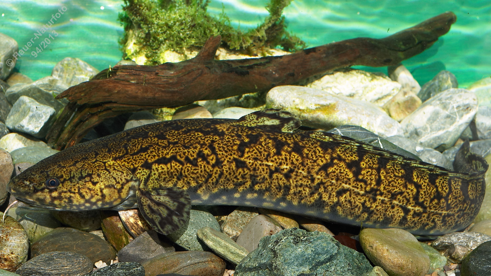

# Aalrutte (Rutte, Quappe)

**Lateinischer Name:** *Lota lota*

## Allgemeine Informationen

### Schonzeit
16. November bis 28. Februar

### Brittelmaß
40 cm

## Merkmale und Aussehen

### Wesentliche Merkmale
- Langgestreckter, nach hinten seitlich abgeflachter Körper
- Langer Bartfaden am Unterkiefer
- Kehlständige Bauchflossen

### Größe
Durchschnittlich 30-50 cm, maximal bis 80 cm und 5 kg

## Lebensweise

### Lebensräume
Flüsse, Bäche und Seen mit kühlem Wasser. Die Aalrutte ist ein Winterlaicher.

### Nahrung
- In der Jugend: Insektenlarven, Würmer und kleinere Wassertiere
- Im Erwachsenenalter: Vorwiegend Fische

## Besonderheiten
Die Aalrutte ist der einzige Vertreter der Dorschartigen (Gadidae) im Süßwasser. Sie ist nachtaktiv und bevorzugt kühle Gewässer. Als Winterlaicher legt sie ihre Eier zwischen November und Februar ab, was unter heimischen Süßwasserfischen ungewöhnlich ist.
