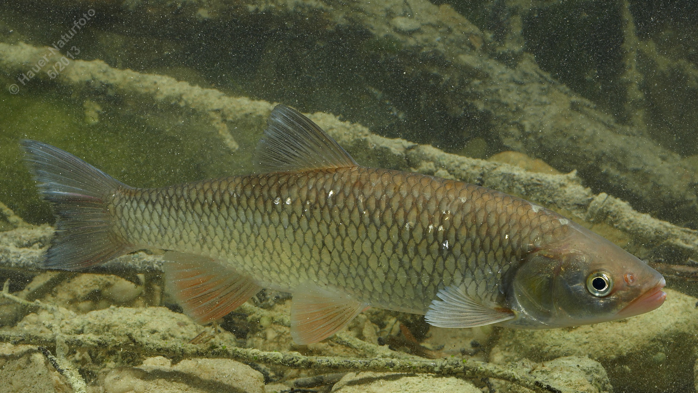

# Aitel (Döbel)

**Lateinischer Name:** *Squalius cephalus*

## Allgemeine Informationen

### Schonzeit
16. März bis 31. Mai

### Brittelmaß
25 cm

## Merkmale und Aussehen

### Wesentliche Merkmale
- Großer, breiter Kopf
- Endständiges weites Maul
- Fast drehrunder Körper
- Dunkel gesäumte Schuppen
- Afterflosse konvex (nach außen gewölbt)

### Größe
Durchschnittlich 30-40 cm, maximal bis 60 cm und über 3 kg

## Lebensweise

### Lebensräume
Fließende und stehende Gewässer von der Forellen- bis zur Brachsenregion. Der Aitel ist sehr anpassungsfähig und kommt in verschiedenen Gewässertypen vor.

### Nahrung
Der Aitel ist ein Allesfresser:
- Jungfische: Kleintiere und Pflanzen
- Erwachsene Fische: Zunehmend räuberisch

## Besonderheiten
Der Aitel (auch Döbel genannt) ist ein sehr anpassungsfähiger und robuster Fisch. Er kann sowohl in schnell fließenden Bächen als auch in ruhigen Seen leben. Mit zunehmendem Alter wird er zum Räuber und jagt auch kleinere Fische.
