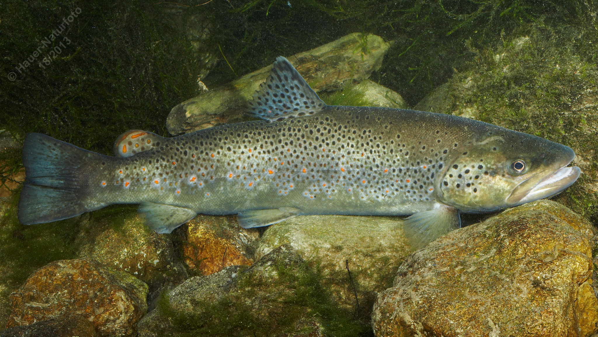

# Bachforelle

**Lateinischer Name:** *Salmo trutta fario*

## Allgemeine Informationen

### Schonzeit
16. September bis 15. März

### Brittelmaß
22 cm

## Merkmale und Aussehen

### Wesentliche Merkmale
- Endständiges Maul
- Torpedoförmiger Körper
- Fettflosse (typisch für Salmoniden)
- Sehr kleine Schuppen
- **Rote Tupfen mit heller Umrandung** an den Körperseiten (charakteristisch!)

### Größe
Durchschnittlich 20-40 cm, unter günstigen Bedingungen bis zu 10 kg

### Alter
5-10 Jahre

## Lebensweise

### Lebensräume
Kühle, sauerstoffreiche fließende und stehende Gewässer vom Hochgebirge bis ins Flachland. Die Bachforelle gibt der "Forellenregion" ihren Namen.

### Nahrung
- Kleintiere aller Art
- Im Alter auch Fische

## Besonderheiten
Die Bachforelle ist einer der bekanntesten heimischen Fische und bevorzugt kalte, klare Gewässer mit hohem Sauerstoffgehalt. Sie ist ein Kieslaicher und legt ihre Eier in Gruben am Gewässerboden ab. Die charakteristischen roten Tupfen mit heller Umrandung unterscheiden sie von der Seeforelle.

## Nicht verwechseln!
**Bachforelle:** Kräftige rote Tupfen mit heller Umrandung  
**Seeforelle:** Größere schwarze Flecken bis zum Bauch, falls rötliche Tupfen vorhanden, dann eher orangefarben ohne Rand
