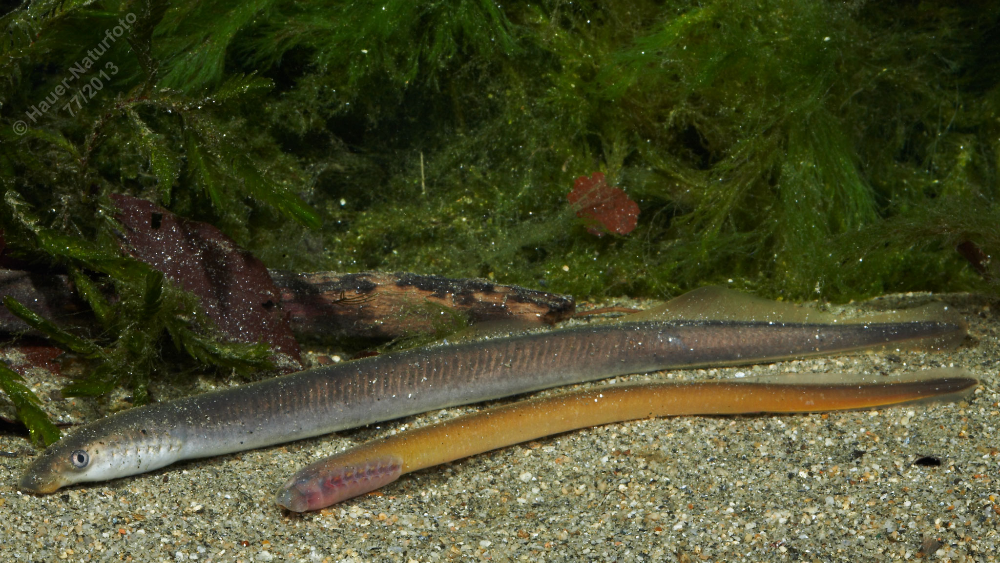

# Bachneunauge

**Lateinischer Name:** *Lampetra planeri*

## Allgemeine Informationen

### Schonzeit
**Ganzjährig geschont!**

### Brittelmaß
Keines (da ganzjährig geschont)

## Merkmale und Aussehen

### Wesentliche Merkmale
- Wurmförmiger Körper
- Zwei mit der Schwanzflosse verbundene Rückenflossen
- Im Larvenstadium blind mit zweilappigem Saugmund
- **Kein echter Fisch** - gehört zu den Rundmäulern (Cyclostomata)

### Größe
12-16 cm

### Alter
Bis 6 Jahre

## Lebensweise

### Lebensräume
Kleinere und größere Bäche mit sandigem Grund und kühlen Wassertemperaturen.

### Nahrung
Die Larven filtern tierische und pflanzliche Stoffe aus dem Wasser. Erwachsene Tiere nehmen keine Nahrung mehr auf.

### Fortpflanzung und Lebenszyklus
1. **Larvenstadium:** 3-5 Jahre im Substrat (eingegraben im Sand)
2. **Verwandlung:** Metamorphose zum erwachsenen Tier
3. **Fortpflanzung:** Nach dem Laichen sterben beide Geschlechter

## Besonderheiten
Das Bachneunauge ist kein echter Fisch, sondern gehört zu den kieferlosen Rundmäulern. Es ist eine sehr ursprüngliche Wirbeltierart. Die Larven leben eingegraben im Gewässerboden und filtern Nahrung aus dem Wasser. Nach der Fortpflanzung sterben die Tiere - ein einmaliges Fortpflanzungsereignis im Leben.
