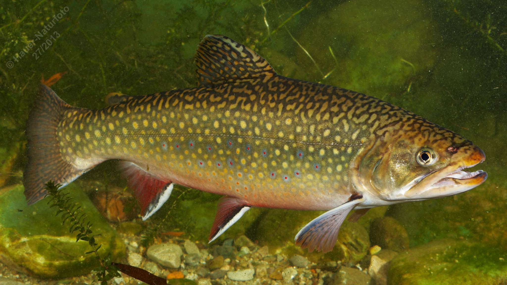

# Bachsaibling

**Lateinischer Name:** *Salvelinus fontinalis*

## Allgemeine Informationen

### Schonzeit
16. September bis 15. März

### Brittelmaß
22 cm

## Merkmale und Aussehen

### Wesentliche Merkmale
- Fettflosse (typisch für Salmoniden)
- Endständiges Maul
- Bauch- und Afterflosse mit **dunklem Saum und weißem Rand**
- Marmorierter Rücken (charakteristisches Muster)

### Größe
Durchschnittlich 35 cm, maximal 55 cm und über 1 kg

### Alter
5-10 Jahre

## Lebensweise

### Lebensräume
Kalte, sauerstoffreiche fließende und stehende Gewässer. Der Bachsaibling hat eine hohe Toleranz gegenüber niedrigen pH-Werten (saures Wasser) und kann daher auch in versauerten Gewässern überleben.

### Nahrung
- Kleintiere
- Bei guten Bedingungen räuberisch (Fische)

### Verhalten
- Wenig standorttreu
- Bildet keine festen Reviere
- **Konkurrent zur Bachforelle**

## Besonderheiten
Der Bachsaibling stammt ursprünglich aus Nordamerika und wurde in Europa eingeführt. Er ist an die weißen Säume seiner Bauch- und Afterflossen gut erkennbar. Seine Toleranz gegenüber saurem Wasser macht ihn robuster als die heimische Bachforelle, was ihn zu einem Konkurrenten macht. Der marmorierte Rücken ist ebenfalls charakteristisch.
