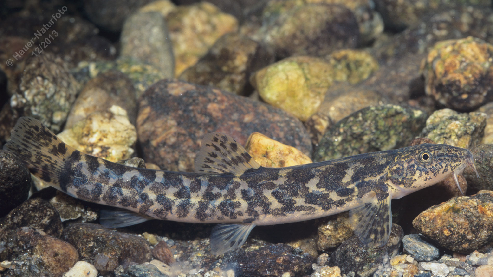

# Bachschmerle (Bartgrundel, Schmerle)

**Lateinischer Name:** *Barbatula barbatula*

## Allgemeine Informationen

### Schonzeit
1. März bis 31. Mai

### Brittelmaß
10 cm

## Merkmale und Aussehen

### Wesentliche Merkmale
- **Sechs Barteln** am Oberkiefer
- Schlanker walzenförmiger Körper
- Marmorierte Körperzeichnung

### Größe
Durchschnittlich 8-10 cm, maximal 15 cm

## Lebensweise

### Lebensräume
Bodenbewohner fließender und stehender Gewässer.

### Nahrung
Bodenorganismen und Kleintiere:
- Insektenlarven
- Würmer
- Kleinkrebse

## Besonderheiten
Die Bachschmerle ist ein typischer Bodenfisch, der mit ihren sechs Barteln am Oberkiefer den Gewässergrund nach Nahrung absucht. Durch ihre marmorierte Zeichnung ist sie am Boden gut getarnt. Sie bevorzugt Gewässer mit steinigem oder kiesigem Untergrund.
