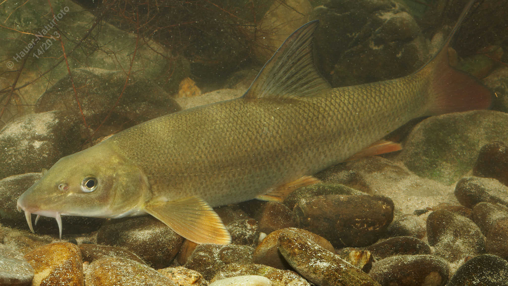

# Barbe (Flussbarbe)

**Lateinischer Name:** *Barbus barbus*

## Allgemeine Informationen

### Schonzeit
16. April bis 31. Mai

### Brittelmaß
35 cm

## Merkmale und Aussehen

### Wesentliche Merkmale
- **Vier Barteln** am Oberlippenrand
- Unterständiges Maul mit wulstigen Lippen
- Strömungsangepasster Körper

### Größe
Durchschnittlich 30-50 cm, maximal 90 cm und 8 kg

### Alter
10-15 Jahre

## Lebensweise

### Lebensräume
Schnell fließende Gewässer mit Schotter- und Sandgrund. Die Barbe gibt der "Barbenregion" ihren Namen - einem Flussabschnitt mit mäßig starker Strömung.

### Nahrung
- Bodenorganismen
- Wirbellose Kleintiere
- Selten Pflanzen

### Verhalten
- Geselliger Grundfisch
- Unternimmt Laichwanderungen flussaufwärts

## Besonderheiten
Die Barbe ist perfekt an das Leben in der Strömung angepasst. Ihr stromlinienförmiger Körper und das unterständige Maul ermöglichen es ihr, am Grund nach Nahrung zu suchen. Mit ihren vier Barteln tastet sie den Gewässerboden nach Nahrung ab. Sie unternimmt zur Laichzeit ausgedehnte Wanderungen flussaufwärts.
