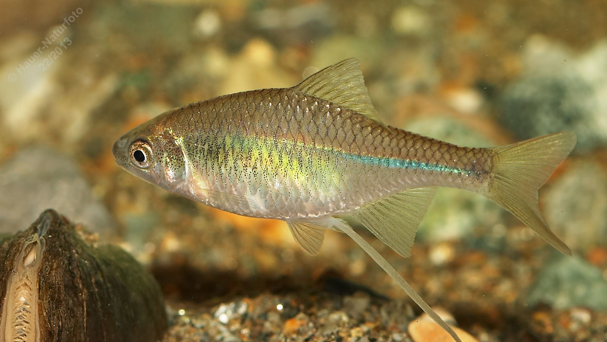

# Bitterling

**Lateinischer Name:** *Rhodeus amarus*

## Allgemeine Informationen

### Schonzeit
**Ganzjährig geschont!**

### Brittelmaß
Keines (da ganzjährig geschont)

## Merkmale und Aussehen

### Wesentliche Merkmale
- **Blaugrün leuchtender Längsstreifen**
- Hochrückig, seitlich abgeflacht
- Endständiges Maul mit kleiner Maulspalte
- Kurze Seitenlinie (nur wenige Schuppen)

### Größe
Durchschnittlich 5 cm, maximal 9 cm

## Lebensweise

### Lebensräume
Teiche und Uferbereich von Seen, langsam fließende Gewässer mit Schlamm- oder Sandgrund.

### Nahrung
- Kleintiere
- Pflanzliche Stoffe

### Fortpflanzung und Verhalten
- **Schwarmfisch**
- **Einzigartige Fortpflanzung:** Eier werden in Muschelkiemen abgelegt
- Brutpflege durch die Muschel

## Besonderheiten
Der Bitterling hat eine einzigartige Fortpflanzungsstrategie: Das Weibchen legt seine Eier mit einer langen Legeröhre in die Kiemenhöhle von Süßwassermuscheln ab. Dort entwickeln sich die Jungfische geschützt vor Fressfeinden. Im Gegenzug heften sich die Muschellarven (Glochidien) an die Fische und werden so verbreitet - eine perfekte Symbiose! Der leuchtende blaugrüne Streifen macht ihn leicht erkennbar.
