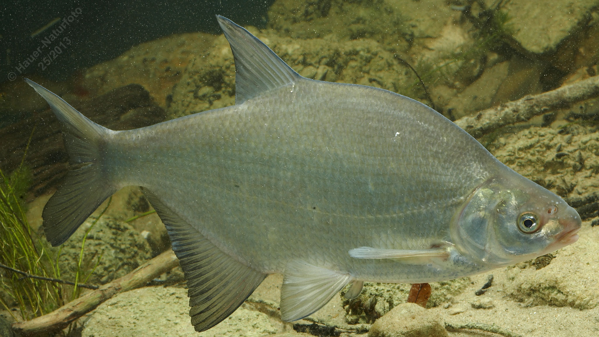

# Brachse (Blei)

**Lateinischer Name:** *Abramis brama*

## Allgemeine Informationen

### Schonzeit
1. Mai bis 31. Mai

### Brittelmaß
25 cm

## Merkmale und Aussehen

### Wesentliche Merkmale
- Hochrückig, stark abgeflacht
- Leicht unterständiges vorstülpbares Maul
- Brustflossen reichen bis zum Bauchflossenansatz
- **Augendurchmesser kleiner als Maulspalte**

### Größe
Durchschnittlich 30 cm, maximal über 70 cm und 8 kg

### Alter
15-20 Jahre

## Lebensweise

### Lebensräume
Seen und langsam fließende Gewässer (Barben- und Brachsenregion). Die Brachse gibt der "Brachsenregion" ihren Namen - dem untersten Abschnitt von Flüssen mit sehr langsamer Strömung.

### Nahrung
- Bodentiere
- Pflanzliche Stoffe

## Besonderheiten
Die Brachse (auch Blei genannt) ist durch ihren stark seitlich abgeflachten, hohen Körper unverwechselbar. Sie lebt in Schwärmen am Gewässergrund und wühlt mit ihrem vorstülpbaren Maul im Schlamm nach Nahrung. Die Brachse kann ein beachtliches Alter von bis zu 20 Jahren erreichen und dabei sehr groß werden.

## Nicht verwechseln!
**Brachse:** Augendurchmesser kleiner als Maulspalte, Brustflossen reichen bis Bauchflossenansatz  
**Güster:** Augendurchmesser größer als Maulspalte, kürzere Brustflossen
