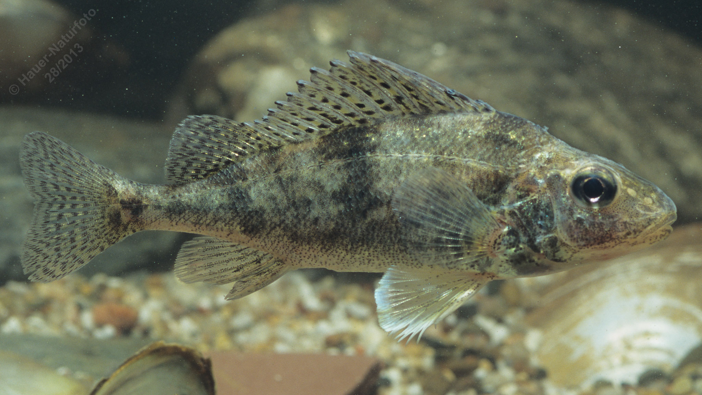

# Donaukaulbarsch

**Lateinischer Name:** *Gymnocephalus baloni*

## Allgemeine Informationen

### Schonzeit
**Ganzjährig geschont!**

### Brittelmaß
Keines (da ganzjährig geschont)

## Merkmale und Aussehen

### Wesentliche Merkmale
- Zwei verbundene Rückenflossen (erste mit Stachelstrahlen)
- Brustständige Bauchflossen
- Grautöne mit dunklen Querbinden
- Zwei spitze Dornen am Kiemendeckel

### Größe
12-15 cm

## Lebensweise

### Lebensräume
Einzugsgebiet der Donau.

### Nahrung
Bodentiere aller Art

## Besonderheiten
Der Donaukaulbarsch ist eine geschützte Art, die nur im Donausystem vorkommt. Er gehört zur Familie der Barsche und ist an den charakteristischen zwei spitzen Dornen am Kiemendeckel erkennbar.
