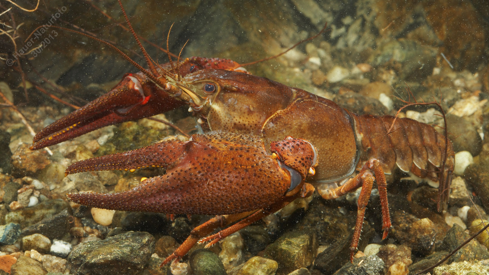

# Edelkrebs (Europäischer Flusskrebs)

**Lateinischer Name:** *Astacus astacus*

## Allgemeine Informationen

### Schonzeit
- **Männchen:** 1. Oktober bis 31. Dezember
- **Weibchen:** Ganzjährig geschont!

### Brittelmaß
- **Männchen:** 12 cm
- **Weibchen:** Keines (da ganzjährig geschont)

## Merkmale und Aussehen

### Wesentliche Merkmale
- Große breite und stark gekörnte Scheren
- Scherenunterseite rötlich
- **Rotes Scherengelenk** (charakteristisch!)
- Zweigeteilte Hinteraugenleiste (zwei Paar Postorbitalknoten)
- Rostrumkiel mit Zacken

### Größe
Durchschnittlich 15 cm (bis 20 cm möglich)  
Gewicht: 200-250 g (bis 350 g möglich)  
Weibchen sind kleiner als Männchen

### Alter
Bis 15 Jahre

## Lebensweise

### Lebensräume
Stehende und fließende sommerwarme Gewässer mit Wassertemperaturen über 15°C. Benötigt strukturierte Gewässer mit Versteckmöglichkeiten (Steine, Wurzeln, Höhlen).

### Nahrung
**Allesfresser:**
- Tierische Nahrung
- Wasserpflanzen
- Algen

### Fortpflanzung
- **Paarungszeit:** Im Herbst
- Befruchtete Eier haften unter dem Hinterleib des Weibchens bis zum Sommer
- Nachtaktiver Bodenbewohner

## Besonderheiten
Der Edelkrebs ist der größte heimische Flusskrebs und durch das charakteristische rote Scherengelenk leicht von eingeschleppten Arten zu unterscheiden. Seine Bestände sind stark gefährdet durch die Krebspest, die von eingeschleppten amerikanischen Krebsarten (Signalkrebs, Kamberkrebs) übertragen wird. Deshalb sind Weibchen ganzjährig geschont, um die Art zu schützen.

## Nicht verwechseln!
**Edelkrebs:** Rotes Scherengelenk, rötliche Scherenunterseite  
**Signalkrebs (nicht heimisch):** Weißlich-türkises Scherengelenk
