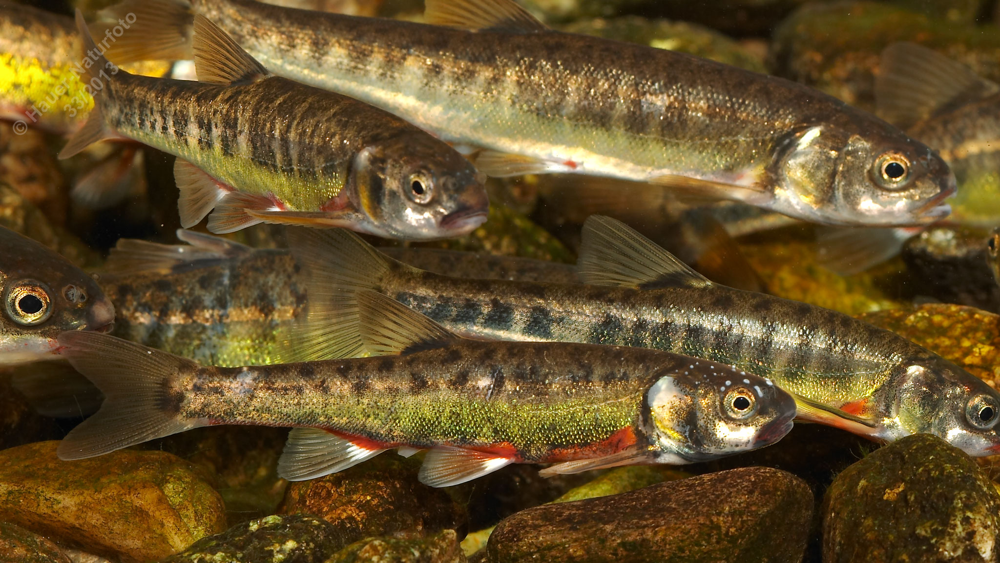

# Elritze (Pfrille)

**Lateinischer Name:** *Phoxinus phoxinus*

## Allgemeine Informationen

### Schonzeit
1. April bis 31. Mai

### Brittelmaß
8 cm

## Merkmale und Aussehen

### Wesentliche Merkmale
- Torpedoförmig, fast drehrund
- Endständiges Maul mit kleiner Maulspalte
- Dunkle Querbänder
- Unvollständige Seitenlinie
- Keine Fettflosse

### Größe
Durchschnittlich 8-10 cm, maximal 15 cm

## Lebensweise

### Lebensräume
Klare fließende und stehende Gewässer bis über 2000 m Seehöhe. Hält sich bevorzugt an der Oberfläche und in Ufernähe auf.

### Nahrung
- Kleintiere der Uferregion und des freien Wassers
- Anflugnahrung (Insekten von der Wasseroberfläche)

### Verhalten
- **Schwarmfisch**
- Eier werden an Steinen abgelegt
- Beide Geschlechter entwickeln zur Laichzeit einen Laichausschlag

## Besonderheiten
Die Elritze ist ein kleiner, geselliger Fisch, der in klaren, sauerstoffreichen Gewässern lebt. Sie kommt auch in Gebirgsgewässern bis über 2000 m Höhe vor. Ihre dunklen Querbänder und die torpedoförmige Gestalt machen sie gut erkennbar. Elritzen sind beliebt als Köderfische beim Angeln.
