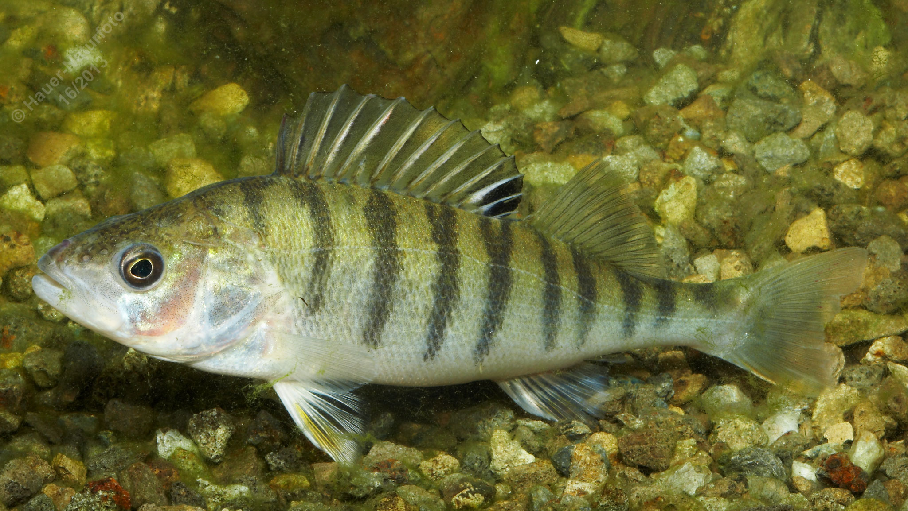

# Flussbarsch (Barsch)

**Lateinischer Name:** *Perca fluviatilis*

## Allgemeine Informationen

### Schonzeit
1. März bis 30. April

### Brittelmaß
10 cm

## Merkmale und Aussehen

### Wesentliche Merkmale
- Zwei getrennte Rückenflossen
- Dunkler Fleck am Ende der ersten Rückenflosse
- 6-11 dunkle Querbänder (Tigerstreifen)
- Brustständige Bauchflossen
- Dorn am Kiemendeckel

### Größe
Durchschnittlich 15-30 cm, maximal über 50 cm und 3 kg

### Alter
Über 10 Jahre

## Lebensweise

### Lebensräume
Wärmere fließende und stehende Gewässer. Der Flussbarsch lebt in Schwärmen.

### Nahrung
- Kleinere Wassertiere
- Fische

## Besonderheiten
Der Flussbarsch (auch einfach "Barsch" genannt) ist einer der häufigsten Raubfische in heimischen Gewässern. Seine charakteristischen dunklen Querbänder (ähnlich wie Tigerstreifen) und die rötlichen Bauchflossen machen ihn unverwechselbar. Junge Barsche leben in großen Schwärmen, ältere in kleineren Gruppen. Die erste Rückenflosse trägt Stachelstrahlen und am Ende einen markanten schwarzen Fleck.
