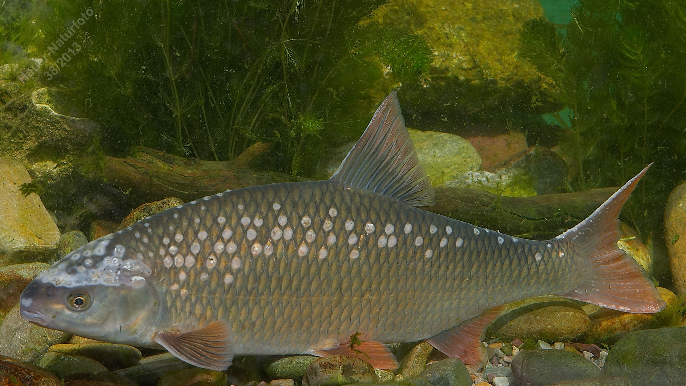

# Frauennerfling (Donaunerfling)

**Lateinischer Name:** *Rutilus pigus*

## Allgemeine Informationen

### Schonzeit
**Ganzjährig geschont!**

### Brittelmaß
Keines (da ganzjährig geschont)

## Merkmale und Aussehen

### Wesentliche Merkmale
- Kleines, leicht unterständiges Maul
- Große metallisch glänzende Schuppen mit Netzmuster
- Rückenflosse beginnt über der Bauchflosse
- Starker Laichausschlag bei Männchen

### Größe
Durchschnittlich 25-35 cm, maximal über 40 cm und 2 kg

## Lebensweise

### Lebensräume
Donau und größere Nebenflüsse.

### Nahrung
Kleintiere der Bodenfauna

## Besonderheiten
Der Frauennerfling ist eine geschützte Donaufischart mit charakteristischem Netzmuster auf den metallisch glänzenden Schuppen. Zur Laichzeit entwickeln die Männchen einen ausgeprägten Laichausschlag (Warzen auf der Haut).
