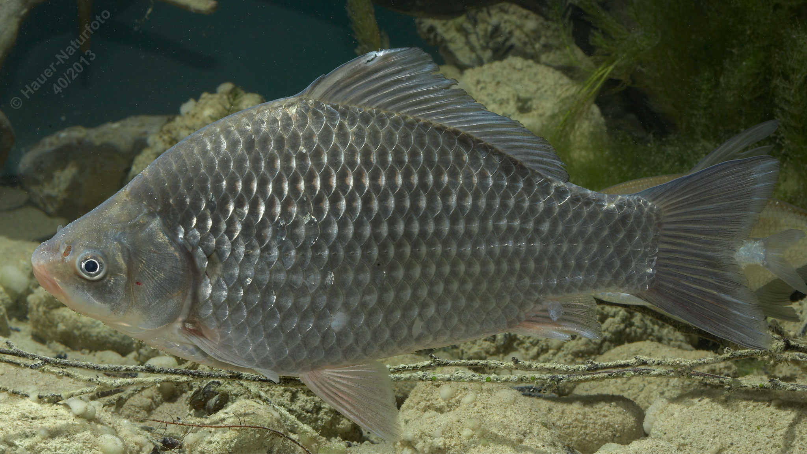

# Giebel

**Lateinischer Name:** *Carassius gibelio*

## Allgemeine Informationen

### Schonzeit
1. Mai bis 31. Mai

### Brittelmaß
25 cm

## Merkmale und Aussehen

### Wesentliche Merkmale
- **Keine Barteln**
- Leicht unterständiges vorstülpbares Maul
- Hochrückig, seitlich abgeflacht
- Zur Gänze beschuppt

### Größe
Durchschnittlich 15-20 cm, maximal 50 cm und 2 kg

## Lebensweise

### Lebensräume
Boden stehender oder langsam fließender Gewässer mit Pflanzenbewuchs.

### Nahrung
- Bodentiere
- Pflanzliche Stoffe

## Besonderheiten
Der Giebel sieht dem Karpfen ähnlich, hat aber keine Barteln. Er ist sehr anpassungsfähig und kann auch in sauerstoffarmen Gewässern überleben. Einige Giebelpopulationen können sich durch Gynogenese (eine Form der eingeschlechtlichen Fortpflanzung) vermehren, bei der nur Weibchen vorkommen.

## Nicht verwechseln!
**Karpfen:** 4 Barteln, endständiges weit vorstülpbares Maul  
**Giebel:** Keine Barteln, schwarzes Bauchfell  
**Karausche:** Keine Barteln, kein schwarzes Bauchfell, Rückenflosse leicht konvex
