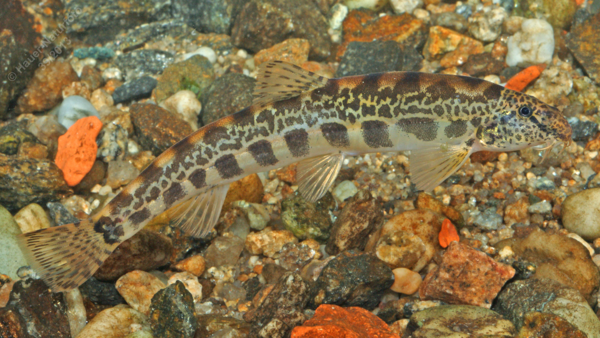

# Goldsteinbeißer

**Lateinischer Name:** *Sabanejewia balcanica*

## Allgemeine Informationen

### Schonzeit
**Ganzjährig geschont!**

### Brittelmaß
Keines (da ganzjährig geschont)

## Merkmale und Aussehen

### Wesentliche Merkmale
- Vier Barteln an der Oberlippe, zwei in den Maulwinkeln
- Kleine Schuppen
- Zweispitzige Stacheln unter dem Auge
- Zwei dunkle Flecken am Schwanzflossenansatz

### Größe
8-12 cm

## Lebensweise

### Lebensräume
Bodenbewohner fließender und stehender Gewässer mit feinsandigem Grund.

### Nahrung
- Kleintiere
- Pflanzliche Stoffe

## Besonderheiten
Der Goldsteinbeißer ist ein kleiner Bodenfisch, der sich tagsüber im Sand eingräbt. Die zweispitzigen Stacheln unter dem Auge und die zwei dunklen Flecken am Schwanzflossenansatz sind charakteristische Merkmale. Er ist eine geschützte Art.
