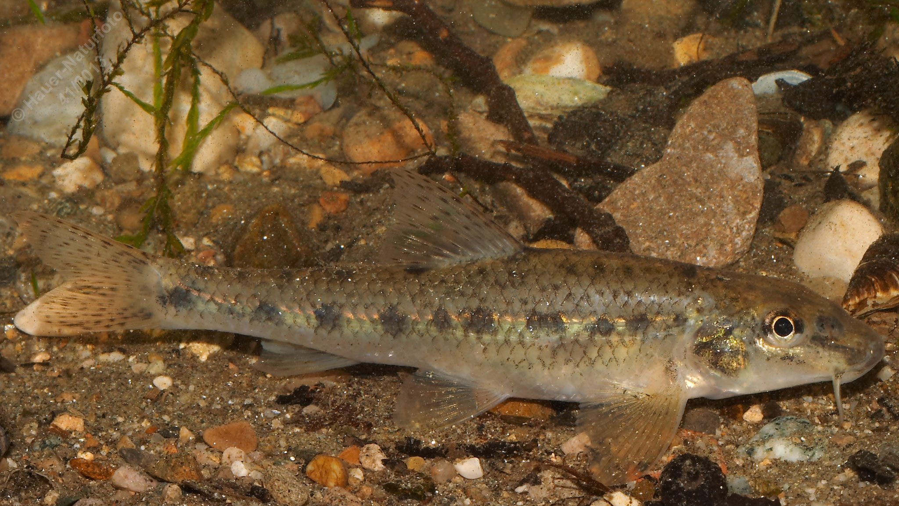

# Gründling

**Lateinischer Name:** *Gobio gobio*

## Allgemeine Informationen

### Schonzeit
1. Mai bis 31. Mai

### Brittelmaß
10 cm

## Merkmale und Aussehen

### Wesentliche Merkmale
- Unterständiges Maul mit stumpfer Schnauze und **zwei kurzen Barteln**
- Spindelförmig, fast drehrund
- Schwarzbraune Fleckenreihe an den Seiten

### Größe
Durchschnittlich 10 cm, selten über 15 cm

## Lebensweise

### Lebensräume
Geselliger Grundfisch in schnellfließenden und stehenden Gewässern mit kiesigem oder sandigem Grund.

### Nahrung
- Kleine Bodentiere
- Pflanzliche Stoffe

## Besonderheiten
Der Gründling ist ein typischer Bodenfisch, der in kleinen Schwärmen lebt. Mit seinen zwei Barteln sucht er den Gewässergrund nach Nahrung ab. Durch seine Färbung ist er am kiesigen Grund gut getarnt. Die charakteristische Fleckenreihe an den Seiten macht ihn gut erkennbar.
