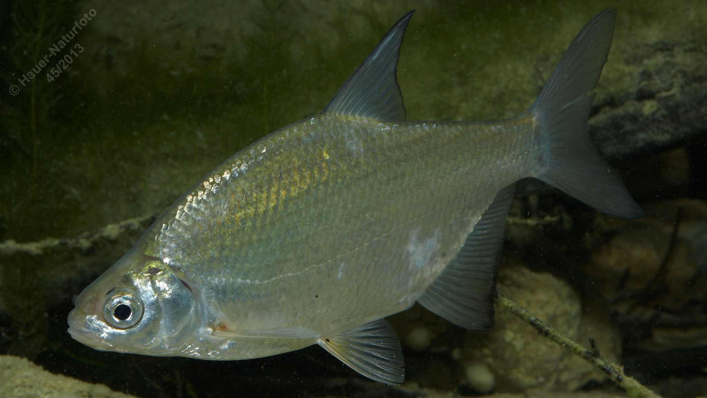

# Güster (Blikke)

**Lateinischer Name:** *Blicca bjoerkna*

## Allgemeine Informationen

### Schonzeit
1. Mai bis 31. Mai

### Brittelmaß
25 cm

## Merkmale und Aussehen

### Wesentliche Merkmale
- Hochrückig, stark abgeflacht
- Leicht unterständiges nicht vorstülpbares Maul
- Brustflossen mit rötlichem Ansatz
- **Augendurchmesser größer als Maulspalte**

### Größe
Durchschnittlich 20-25 cm

## Lebensweise

### Lebensräume
Seen und langsam fließende Gewässer.

### Nahrung
- Kleinlebewesen
- Pflanzliche Stoffe

## Besonderheiten
Die Güster ähnelt der Brachse, ist aber kleiner und schlanker. Ein wichtiges Unterscheidungsmerkmal ist der Augendurchmesser, der bei der Güster größer ist als die Maulspalte (bei der Brachse umgekehrt). Auch die Brustflossen sind kürzer und reichen nicht bis zum Bauchflossenansatz.

## Nicht verwechseln!
**Güster:** Augendurchmesser größer als Maulspalte, kürzere Brustflossen  
**Brachse:** Augendurchmesser kleiner als Maulspalte, Brustflossen reichen bis Bauchflossenansatz
