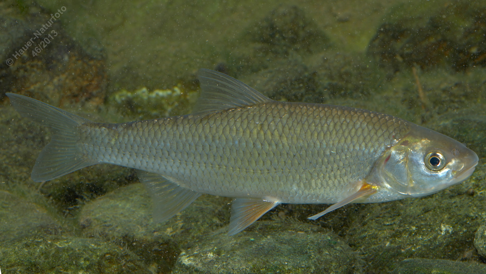

# Hasel

**Lateinischer Name:** *Leuciscus leuciscus*

## Allgemeine Informationen

### Schonzeit
16. März bis 31. Mai

### Brittelmaß
20 cm

## Merkmale und Aussehen

### Wesentliche Merkmale
- Spindelförmig, seitlich abgeflacht
- Unterständiges Maul
- Bauchseitige Flossen blassgelb bis orange
- Afterflosse konkav (nach innen gewölbt)

### Größe
Durchschnittlich 20 cm, selten über 30 cm und 0,5 kg

## Lebensweise

### Lebensräume
Rasch fließende Gewässer, seltener Seen. Lebt in kleinen Schwärmen.

### Nahrung
- Wirbellose Kleintiere (insbesondere Insektenlarven)
- Selten Pflanzen

## Besonderheiten
Der Hasel ist ein typischer Bewohner schnellfließender Gewässer. Er bildet kleine Schwärme und ernährt sich hauptsächlich von Insektenlarven. Die gelb-orange gefärbten bauchseitigen Flossen und die nach innen gewölbte Afterflosse sind charakteristisch.
