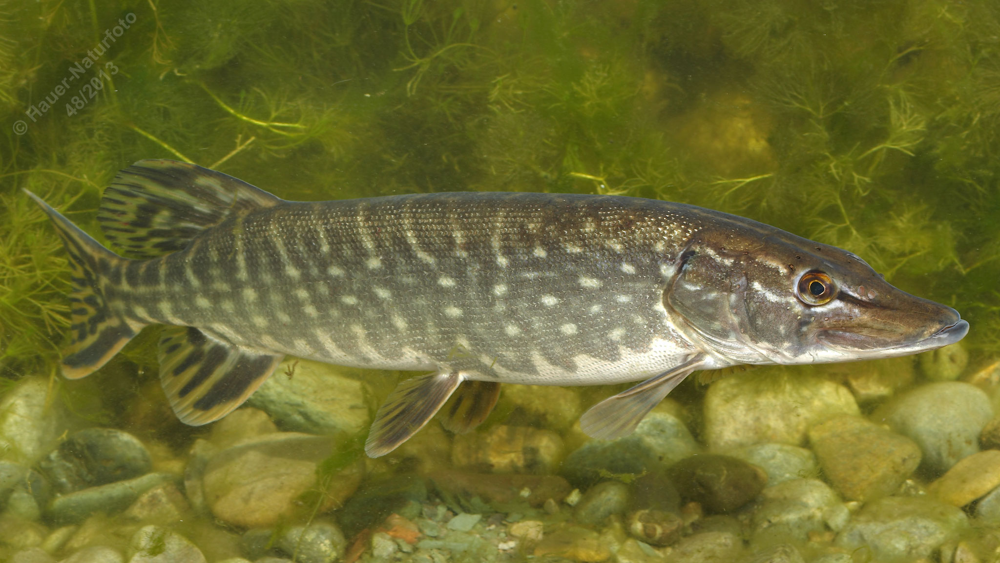

# Hecht

**Lateinischer Name:** *Esox lucius*

## Allgemeine Informationen

### Schonzeit
1. Februar bis 30. April (Krautlaicher)

**Abweichende Schonzeiten:**
- Attersee: 01. April – 15. Mai
- Donau: 1. Februar – 31. Mai
- Mondsee: 1. April – 15. Mai
- Traunsee: 1. April – 15. Mai

### Brittelmaß
60 cm

**Abweichende Brittelmaße:**
- Attersee: 50 cm
- Mondsee: 50 cm
- Traunsee: 50 cm

## Merkmale und Aussehen

### Wesentliche Merkmale
- Langgestreckter, walzenförmiger und seitlich nur mäßig abgeflachter Körper
- Relativ langer Kopf mit **entenschnabelähnlichem, oberständigem Maul**
- Große, weit hinten liegende Rückenflosse

### Größe
Durchschnittlich 50-100 cm, maximal bis 150 cm oder über 25 kg

### Alter
Über 30 Jahre möglich

## Lebensweise

### Lebensräume
Stehende und langsam fließende Gewässer, hält sich gerne in Ufernähe auf.

### Nahrung
- Fische aller Art
- Frösche
- Vögel
- Sogar kleine Säugetiere

### Verhalten
- **Standfisch** (bleibt in einem Revier)
- **Einzelgänger**
- **Lauerjäger** (wartet bewegungslos auf Beute)

## Besonderheiten
Der Hecht ist ein perfekter Lauerjäger mit seinem torpedoförmigen Körper und dem großen, mit scharfen Zähnen besetzten Maul. Er wartet regungslos im Pflanzenbewuchs oder an Strukturen und schießt blitzschnell auf vorbeikommende Beute. Seine Rückenflosse sitzt weit hinten am Körper, was ihm explosive Beschleunigung ermöglicht. Als einer der größten heimischen Raubfische spielt er eine wichtige Rolle im Ökosystem.
