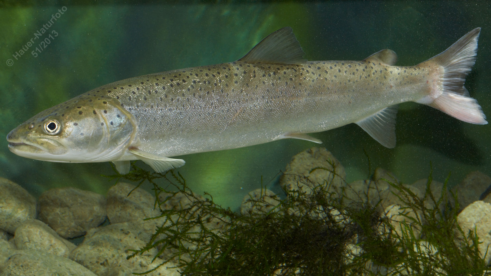

# Huchen (Donaulachs, Rotfisch)

**Lateinischer Name:** *Hucho hucho*

## Allgemeine Informationen

### Schonzeit
16. Februar bis 31. Mai

### Brittelmaß
85 cm

## Merkmale und Aussehen

### Wesentliche Merkmale
- Walzenförmig, langgestreckt
- Große Fettflosse
- Viele dunkle Flecken am Körper, **aber nicht auf den Flossen**

### Größe
Bis 150 cm und 20 kg, über 30 kg selten

### Alter
Bis 15 Jahre

## Lebensweise

### Lebensräume
Donau und größere Zuflüsse. Der Huchen ist endemisch im Donausystem (kommt nur dort vor).

### Nahrung
Raubfisch, ernährt sich fast ausschließlich von Fischen (schon im Jugendstadium).

### Verhalten
- **Standfisch** (bevorzugt tiefe Bereiche)
- Wandert zum Laichen flussaufwärts

## Besonderheiten
Der Huchen ist der größte ständig im Süßwasser lebende Lachsfisch Europas. Er ist endemisch im Donausystem und wird auch "Donaulachs" genannt. Seine Bestände sind durch Lebensraumverlust und Verbauungen stark gefährdet. Ein wichtiges Unterscheidungsmerkmal: Die dunklen Flecken befinden sich nur am Körper, nicht auf den Flossen.
