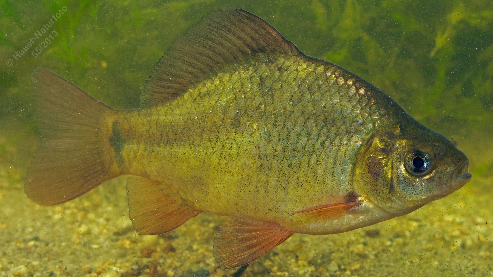

# Karausche

**Lateinischer Name:** *Carassius carassius*

## Allgemeine Informationen

### Schonzeit
**Ganzjährig geschont!**

### Brittelmaß
Keines (da ganzjährig geschont)

## Merkmale und Aussehen

### Wesentliche Merkmale
- **Keine Barteln**
- Endständiges nicht vorstülpbares Maul
- Hochrückig, seitlich abgeflacht
- Rückenflosse leicht konvex (nach außen gewölbt)
- Im Jugendstadium schwarzer Fleck an der Schwanzwurzel

### Größe
Durchschnittlich 15-20 cm, maximal 50 cm und über 2 kg

## Lebensweise

### Lebensräume
Boden stehender oder langsam fließender Gewässer mit Pflanzenbewuchs. Die Karausche kann auch in sauerstoffarmen Gewässern überleben.

### Nahrung
- Bodentiere
- Pflanzliches Material

## Besonderheiten
Die Karausche ist extrem widerstandsfähig und kann auch in sauerstoffarmen Gewässern überleben, in denen andere Fische nicht leben können. Sie ist durch ihre konvexe (nach außen gewölbte) Rückenflosse von ähnlichen Arten zu unterscheiden. Jungfische haben einen charakteristischen schwarzen Fleck an der Schwanzwurzel.

## Nicht verwechseln!
**Karausche:** Keine Barteln, endständiges nicht vorstülpbares Maul, Rückenflosse konvex  
**Karpfen:** 4 Barteln, weit vorstülpbares Maul  
**Giebel:** Keine Barteln, schwarzes Bauchfell
