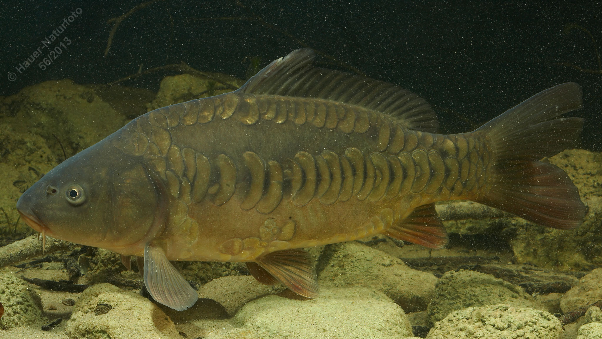

# Karpfen

**Lateinischer Name:** *Cyprinus carpio*

## Allgemeine Informationen

### Schonzeit
1. Mai bis 31. Mai (Krautlaicher)

**Abweichende Schonzeit:**
- Mondsee: 1. Juni – 30. Juni

### Brittelmaß
35 cm

## Merkmale und Aussehen

### Wesentliche Merkmale
- **4 Barteln:** Zwei kürzere an der Oberlippe, zwei längere in den Maulwinkeln
- Endständiges, weit vorstülpbares Maul
- Der Körper kann ganz oder nur teilweise beschuppt sein (verschiedene Zuchtformen: Schuppenkarpfen, Spiegelkarpfen, Lederkarpfen)

### Größe
Durchschnittlich 35-50 cm mit 2-3 kg, maximal 100 cm und über 30 kg

### Alter
Über 40 Jahre

## Lebensweise

### Lebensräume
Der Karpfen bevorzugt warme, nahrungsreiche, stehende und langsam fließende Gewässer mit weichem Grund und Pflanzenbewuchs.

### Nahrung
- Wirbellose Bodentiere
- Pflanzliche Stoffe

## Besonderheiten
Der Karpfen ist ein wichtiger Kulturfolger und wurde bereits seit Jahrhunderten gezüchtet. Es gibt verschiedene Zuchtformen mit unterschiedlicher Beschuppung: Schuppenkarpfen (vollständig beschuppt), Spiegelkarpfen (teilweise beschuppt) und Lederkarpfen (fast ohne Schuppen). Mit seinem vorstülpbaren Maul wühlt er im Schlamm nach Nahrung. Karpfen können sehr alt werden (über 40 Jahre) und erreichen beachtliche Größen.

## Nicht verwechseln!
**Karpfen:** 4 Barteln, endständiges weit vorstülpbares Maul  
**Karausche:** Keine Barteln, endständiges nicht vorstülpbares Maul  
**Giebel:** Keine Barteln, schwarzes Bauchfell
