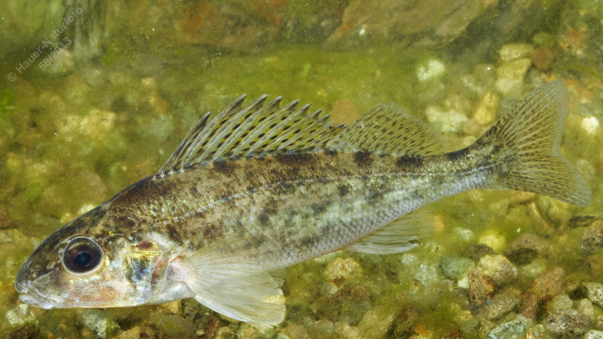

# Kaulbarsch

**Lateinischer Name:** *Gymnocephalus cernuus*

## Allgemeine Informationen

### Schonzeit
1. April bis 31. Mai

### Brittelmaß
Kein Brittelmaß

## Merkmale und Aussehen

### Wesentliche Merkmale
- Zwei verbundene Rückenflossen (vordere mit Stachelstrahlen)
- Hochrückig mit Kammschuppen
- Brustständige Bauchflossen
- Unregelmäßige dunkle Flecken

### Größe
Durchschnittlich 12-15 cm, selten größer

## Lebensweise

### Lebensräume
Größere Flüsse und Seen.

### Nahrung
Wirbellose Kleintiere

### Verhalten
Schwarmfisch

## Besonderheiten
Der Kaulbarsch gehört zur Familie der Barsche und lebt in Schwärmen am Gewässergrund. Er ist durch seine Kammschuppen und die unregelmäßigen dunklen Flecken gekennzeichnet. Trotz seiner geringen Größe hat er Stachelstrahlen in der vorderen Rückenflosse.
