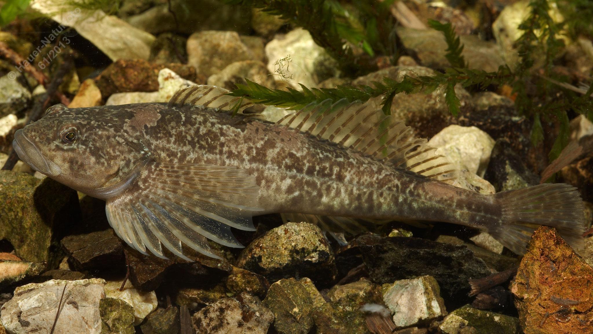

# Koppe (Groppe, Mühlkoppe)

**Lateinischer Name:** *Cottus gobio*

## Allgemeine Informationen

### Schonzeit
1. Februar bis 30. April

### Brittelmaß
8 cm

## Merkmale und Aussehen

### Wesentliche Merkmale
- Breiter abgeflachter Kopf und Vorderkörper
- Endständiges weites Maul mit wulstigen Lippen
- Ungewöhnlich große Brustflossen
- **Keine Schwimmblase**

### Größe
Durchschnittlich 10 cm, maximal 18-20 cm

## Lebensweise

### Lebensräume
Kühle, saubere sauerstoffreiche fließende und stehende Gewässer bis über 2000 m Seehöhe. Aufgrund der fehlenden Schwimmblase lebt die Koppe ausschließlich am Gewässergrund.

### Nahrung
- Bodentiere
- Fischlaich
- Brütlinge (Jungfische)

### Verhalten
- **Bodenfisch**
- **Indikator für gute Wasserqualität**
- Nachtaktiv
- Echte Brutpflege durch das Männchen

## Besonderheiten
Die Koppe ist ein typischer Bodenfisch mit charakteristisch abgeflachtem Kopf und großen Brustflossen. Da sie keine Schwimmblase besitzt, kann sie nicht im Freiwasser schwimmen. Sie ist ein wichtiger Bioindikator - ihr Vorkommen zeigt gute Wasserqualität an. Die Männchen betreiben echte Brutpflege und bewachen die Eier bis zum Schlüpfen.
