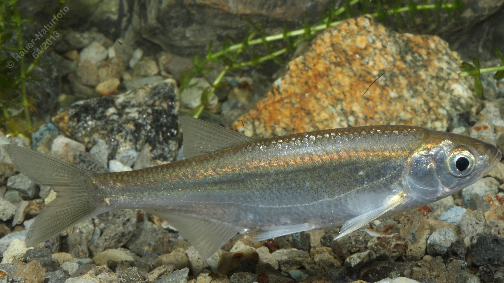

# Laube (Ukelei)

**Lateinischer Name:** *Alburnus alburnus*

## Allgemeine Informationen

### Schonzeit
1. Mai bis 30. Juni

### Brittelmaß
10 cm

## Merkmale und Aussehen

### Wesentliche Merkmale
- Oberständiges Maul ohne verdickten Unterkiefer
- Rückenflosse und Afterflosse überlappen sich
- Schlanker seitlich abgeflachter Körper
- Starker Silberglanz
- Schuppen sitzen locker (fallen leicht ab)

### Größe
Durchschnittlich 10-15 cm, maximal über 20 cm

## Lebensweise

### Lebensräume
Langsam fließende und stehende Gewässer, vorwiegend an der Oberfläche.

### Nahrung
- Kleintiere
- Plankton
- Anflug (Insekten von der Oberfläche)
- Pflanzliche Stoffe

## Besonderheiten
Die Laube (auch Ukelei genannt) ist ein typischer Oberflächenfisch mit stark silberglänzenden, locker sitzenden Schuppen. Früher wurde aus den Schuppen der Laube "Perlmuttessenz" für die Herstellung künstlicher Perlen gewonnen. Sie lebt in Schwärmen und ernährt sich hauptsächlich von der Wasseroberfläche.
