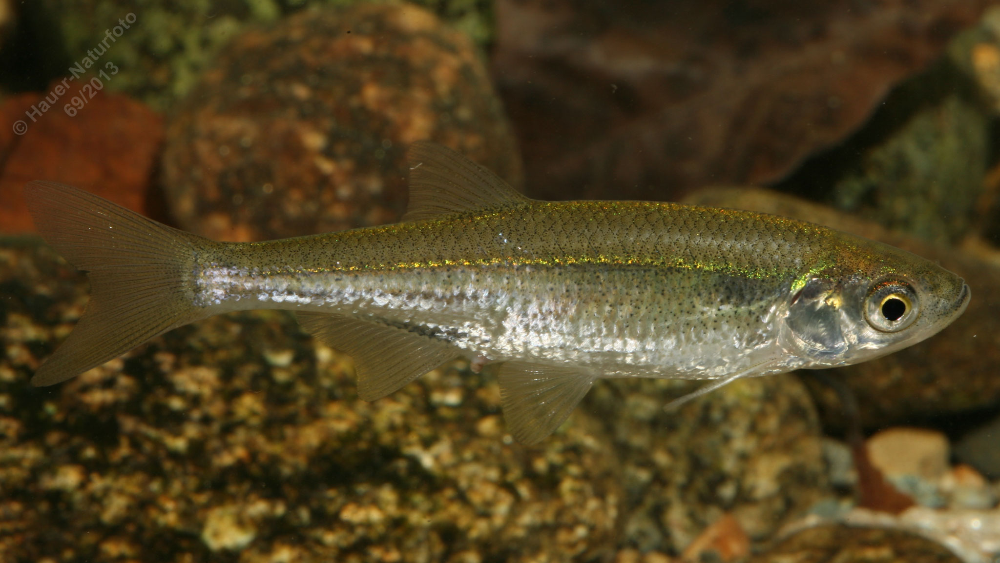

# Moderlieschen

**Lateinischer Name:** *Leucaspius delineatus*

## Allgemeine Informationen

### Schonzeit
**Ganzjährig geschont!**

### Brittelmaß
Keines (da ganzjährig geschont)

## Merkmale und Aussehen

### Wesentliche Merkmale
- Oberständiges Maul mit **verdicktem Unterkiefer**
- Sehr kurze Seitenlinie (maximal 12 Schuppen)
- Torpedoförmig, seitlich abgeflacht
- Bläulicher Streifen an den Seiten

### Größe
Durchschnittlich 6-8 cm, selten bis 10 cm

## Lebensweise

### Lebensräume
Schwach fließende oder stehende Gewässer mit dichtem Pflanzenbewuchs. Hält sich an der Oberfläche auf.

### Nahrung
- Kleintiere
- Anflugnahrung (Insekten von der Oberfläche)
- Pflanzliche Stoffe

### Verhalten
- **Schwarmfisch**
- Eier werden in ringförmigen Bändern an Pflanzen abgelegt
- Bewachung durch das Männchen

## Besonderheiten
Das Moderlieschen ist ein sehr kleiner Fisch, der dichte Pflanzenbewuchs benötigt. Charakteristisch sind die sehr kurze Seitenlinie (nur wenige Schuppen) und der verdickte Unterkiefer. Die Männchen bewachen die in Ringen an Pflanzen abgelegten Eier.
