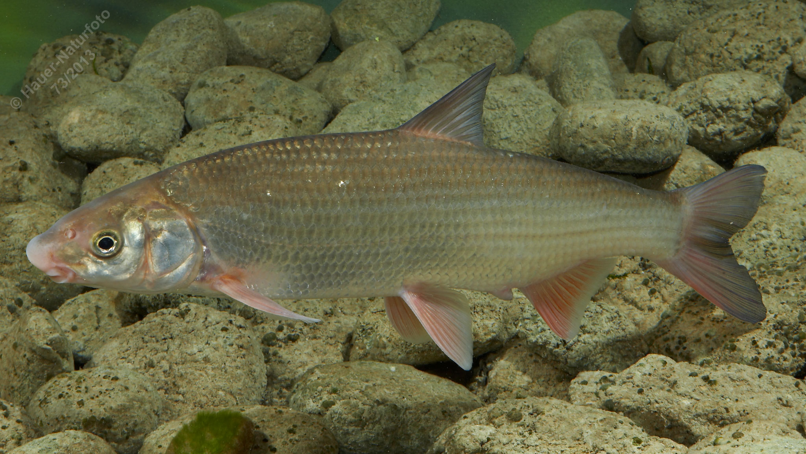

# Nase (Näsling)

**Lateinischer Name:** *Chondrostoma nasus*

## Allgemeine Informationen

### Schonzeit
16. März bis 31. Mai

### Brittelmaß
35 cm

## Merkmale und Aussehen

### Wesentliche Merkmale
- Wulstige Schnauze
- Querständiges Maul mit hornigen Lippen
- Unterlippe mit scharfkantigen Rändern
- Dunkel gefärbtes Bauchfell

### Größe
Durchschnittlich 30-40 cm, maximal über 50 cm und über 2 kg

## Lebensweise

### Lebensräume
Barbenregion der Flüsse, bevorzugt Strömung. Lebt in Schwärmen.

### Nahrung
Pflanzliche Stoffe und Algen (werden mit den scharfkantigen Lippen vom Untergrund abgeschabt).

## Besonderheiten
Die Nase hat ein charakteristisches unterständiges, querstehendes Maul mit hornigen, scharfkantigen Lippen. Damit schabt sie Algen und pflanzliche Aufwuchs von Steinen ab. Sie lebt in Schwärmen in der Strömung und ist an schnellfließende Gewässer angepasst. Die wulstige "Nase" gab dem Fisch seinen Namen.
