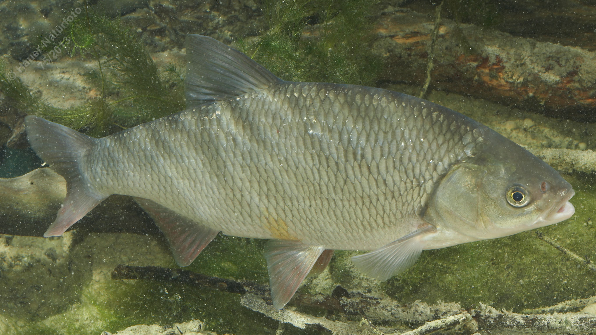

# Nerfling (Aland, Seider)

**Lateinischer Name:** *Leuciscus idus*

## Allgemeine Informationen

### Schonzeit
**Ganzjährig geschont!**

### Brittelmaß
Keines (da ganzjährig geschont)

## Merkmale und Aussehen

### Wesentliche Merkmale
- Endständiges bis leicht oberständiges Maul
- Maulspalte schräg nach oben
- Bauch-, After- und Schwanzflosse oft rötlich
- Vergleichsweise kleine Schuppen
- Spitz zulaufender Fortsatz am Kiemendeckel

### Größe
Durchschnittlich 30-40 cm, maximal bis 70 cm und über 6 kg

### Alter
7-10 Jahre

## Lebensweise

### Lebensräume
Fließende Bereiche der Barben- und Brachsenregion, auch Seen.

### Nahrung
Hauptsächlich wirbellose Tiere

## Besonderheiten
Der Nerfling (auch Aland genannt) ist eine geschützte Art, die in fließenden Gewässern lebt. Die rötliche Färbung der Bauchflossen und der spitz zulaufende Fortsatz am Kiemendeckel sind charakteristische Merkmale. In der Aquaristik ist die Goldvarietät als "Goldorfe" bekannt.
