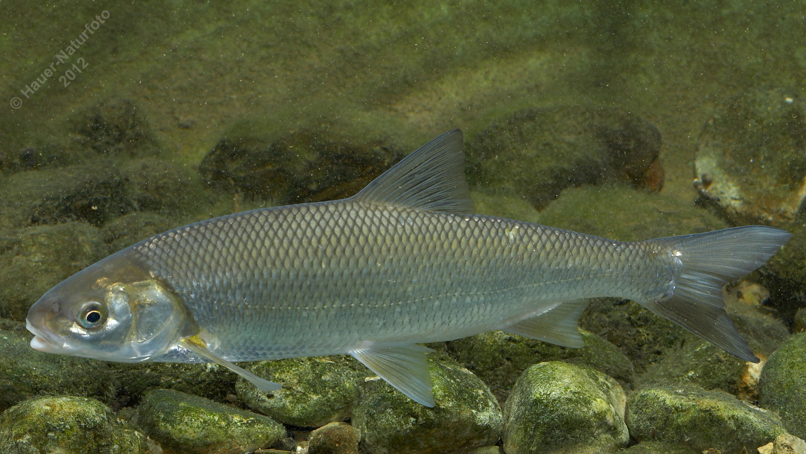

# Perlfisch

**Lateinischer Name:** *Rutilus meidingeri*

## Allgemeine Informationen

### Schonzeit
**Ganzjährig geschont!**

### Brittelmaß
Keines (da ganzjährig geschont)

## Merkmale und Aussehen

### Wesentliche Merkmale
- Leicht unterständiges Maul
- Kleine schräg nach unten verlaufende Maulspalte
- Fast runder Körperquerschnitt
- Afterflosse konkav (nach innen gewölbt)
- Kräftiger perlförmiger Laichausschlag bei Männchen (daher der Name!)

### Größe
Durchschnittlich 40-60 cm, maximal bis 70 cm und 5 kg

## Lebensweise

### Lebensräume
Voralpenseen (Wolfgang-, Mond-, Attersee) und Donau. Endemische Art (kommt nur in Oberösterreich vor).

### Nahrung
- Kleine Wassertiere
- Muscheln (besonders Dreikantmuschel)
- Insektenlarven
- Würmer
- Pflanzliche Stoffe

### Fortpflanzung
Laicht Mai-Juni an kiesigen flachen Stellen im See und in Zu-/Abflüssen.

## Besonderheiten
Der Perlfisch ist eine endemische Art, die nur in wenigen oberösterreichischen Seen und der Donau vorkommt. Der Name stammt vom perlförmigen Laichausschlag der Männchen. Er ist eine seltene und geschützte Art.
