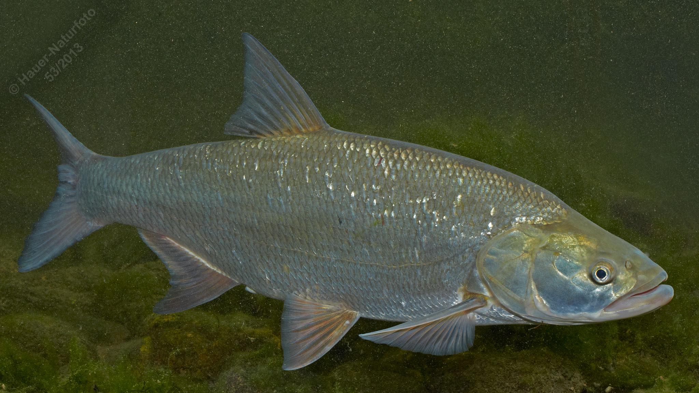

# Rapfen (Schied)

**Lateinischer Name:** *Aspius aspius*

## Allgemeine Informationen

### Schonzeit
16. April bis 31. Mai

### Brittelmaß
45 cm

## Merkmale und Aussehen

### Wesentliche Merkmale
- Breites oberständiges Maul mit verdicktem Unterkiefer (passt in Vertiefung des Oberkiefers)
- Maulspalte reicht bis zur Augenmitte
- Afterflosse sichelförmig eingebuchtet
- Langgestreckter abgeflachter Körper

### Größe
Durchschnittlich 40-60 cm, maximal bis 100 cm und 10 kg

## Lebensweise

### Lebensräume
Mündungsbereiche der Donau-Zuflüsse, Altwässer und Seen.

### Nahrung
- In der Jugend: Kleintierfresser
- Im Erwachsenenalter: Fast ausschließlich Fische

### Verhalten
- Jungfische leben in Schwärmen
- Im Alter Einzelgänger

## Besonderheiten
Der Rapfen ist ein großer, oberflächenorientierter Raubfisch. Er jagt durch blitzschnelle Attacken an der Wasseroberfläche, wobei er mit seinem großen Maul kleine Fische erbeutet. Seine Jagdtechnik ist spektakulär: Er schießt aus der Tiefe nach oben und schlägt mit dem Körper auf die Wasseroberfläche, um Fische zu betäuben. Der verdickte Unterkiefer passt charakteristisch in eine Vertiefung des Oberkiefers.
