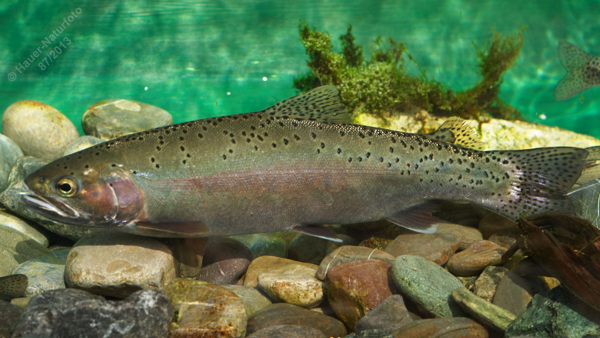

# Regenbogenforelle

**Lateinischer Name:** *Oncorhynchus mykiss*

## Allgemeine Informationen

### Schonzeit
1. Dezember bis 15. März

### Brittelmaß
22 cm

## Merkmale und Aussehen

### Wesentliche Merkmale
- Fettflosse (typisch für Salmoniden)
- **Regenbogenfarbenes Band** entlang der Seitenlinie und am Kiemendeckel
- Viele schwarze Tupfen auf Rücken und Flossen

### Größe
Durchschnittlich 25-50 cm, selten größer und über 6 kg

### Alter
5-7 Jahre

## Lebensweise

### Lebensräume
Kalte, sauerstoffreiche fließende und stehende Gewässer.

### Nahrung
- Kleintiere
- Im Alter auch Fische

### Verhalten
- Wenig standorttreu
- Anpassungsfähig
- **Konkurrent zur Bachforelle**

## Besonderheiten
Die Regenbogenforelle stammt ursprünglich aus Nordamerika und wurde in Europa eingeführt. Sie ist an dem charakteristischen regenbogenfarbenen Band entlang der Seitenlinie leicht erkennbar. Die Regenbogenforelle wächst schneller als die Bachforelle und ist weniger anspruchsvoll, was sie zu einem Konkurrenten der heimischen Bachforelle macht. Sie wird häufig in Forellenteichwirtschaften gezüchtet.
