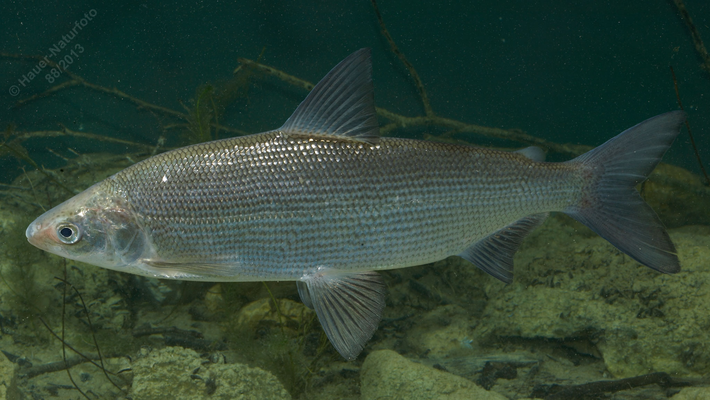

# Reinanke (Große Schweberenke, Maräne)

**Lateinischer Name:** *Coregonus sp2.*

## Allgemeine Informationen

### Schonzeit
16. Oktober bis 31. Dezember

### Brittelmaß
30 cm

## Merkmale und Aussehen

### Wesentliche Merkmale
- Fettflosse (typisch für Salmoniden)
- Kleines endständiges/unterständiges Maul
- Kegelförmiger Kopf
- Langgestreckter hochrückiger Körper mit großen Schuppen
- Dunkle (geschwärzte) Flossen

### Größe
Durchschnittlich 30-50 cm, maximal bis 6 kg

## Lebensweise

### Lebensräume
Seen des Voralpengebietes und Donau. Lebt im Freiwasser.

### Nahrung
- Planktonkrebse
- Insektenlarven
- Würmer

## Besonderheiten
Die Reinanke gehört zur Familie der Lachsfische (Salmoniden) und lebt im Freiwasser von Voralpenseen. Sie ernährt sich von Plankton und ist ein wichtiger Speisefisch. Die dunklen Flossen und der kegelförmige Kopf sind charakteristische Merkmale. Renken sind Winterlaicher.
