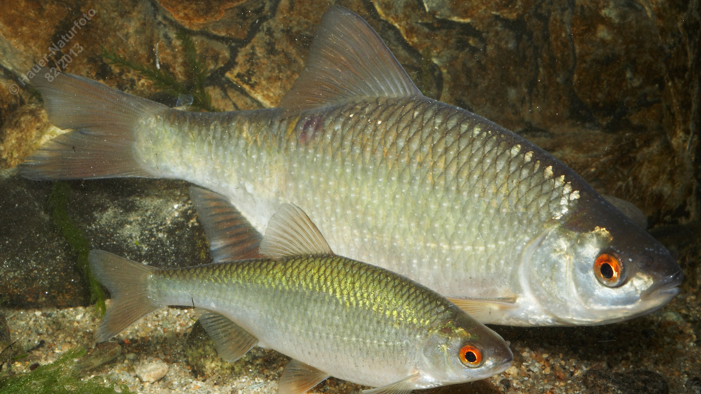

# Rotauge (Plötze)

**Lateinischer Name:** *Rutilus rutilus*

## Allgemeine Informationen

### Schonzeit
1. April bis 31. Mai

### Brittelmaß
12 cm

## Merkmale und Aussehen

### Wesentliche Merkmale
- **Augenrand fast immer rötlich**
- Endständiges Maul mit kleiner Maulspalte
- Rückenflosse beginnt über dem Bauchflossenansatz

### Größe
Durchschnittlich 15-20 cm, maximal über 30 cm und bis 2 kg

### Alter
10-15 Jahre

## Lebensweise

### Lebensräume
Langsam fließende und stehende Gewässer. Lebt in Schwärmen.

### Nahrung
- Wirbellose Tiere (Zooplankton, Insekten, Würmer)
- Pflanzen
- Algen

## Besonderheiten
Das Rotauge (auch Plötze genannt) ist einer der häufigsten Fische in heimischen Gewässern. Der charakteristische rötliche Augenrand gab dem Fisch seinen Namen. Es lebt in großen Schwärmen und ist sehr anpassungsfähig. Das Rotauge kann mit der Rotfeder verwechselt werden, unterscheidet sich aber durch die Position der Rückenflosse.

## Nicht verwechseln!
**Rotauge:** Endständiges Maul, Rückenflosse beginnt über Bauchflossenansatz  
**Rotfeder:** Oberständiges Maul, Rückenflosse beginnt deutlich hinter Bauchflossenansatz
