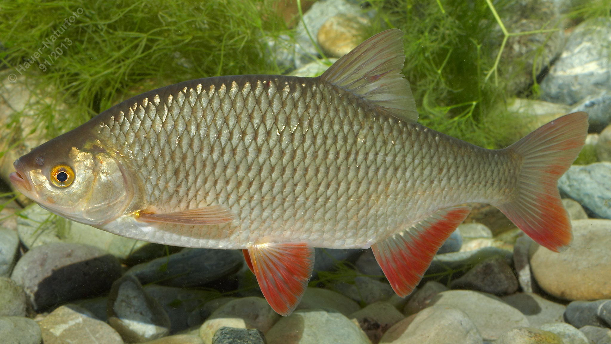

# Rotfeder

**Lateinischer Name:** *Scardinius erythrophthalmus*

## Allgemeine Informationen

### Schonzeit
1. April bis 31. Mai

### Brittelmaß
15 cm

## Merkmale und Aussehen

### Wesentliche Merkmale
- **Oberständiges Maul**
- Rückenflosse beginnt deutlich **hinter** dem Bauchflossenansatz
- Orange bis blutrot gefärbte bauchseitige Flossen

### Größe
Durchschnittlich 20 cm, maximal über 40 cm und bis 2 kg

### Alter
10-12 Jahre

## Lebensweise

### Lebensräume
Langsam fließende und stehende Gewässer mit weichem Grund und Wasserpflanzen. Lebt in Schwärmen.

### Nahrung
- **Überwiegend Wasserpflanzen und Algen**
- Aber auch wirbellose Tiere

## Besonderheiten
Die Rotfeder ähnelt dem Rotauge, unterscheidet sich aber deutlich durch das oberständige Maul und die Position der Rückenflosse, die deutlich weiter hinten ansetzt. Sie ernährt sich im Gegensatz zum Rotauge hauptsächlich von Pflanzen. Die intensiv rot gefärbten Bauchflossen sind charakteristisch.

## Nicht verwechseln!
**Rotfeder:** Oberständiges Maul, Rückenflosse beginnt deutlich hinter Bauchflossenansatz, hauptsächlich Pflanzenfresser  
**Rotauge:** Endständiges Maul, Rückenflosse beginnt über Bauchflossenansatz
