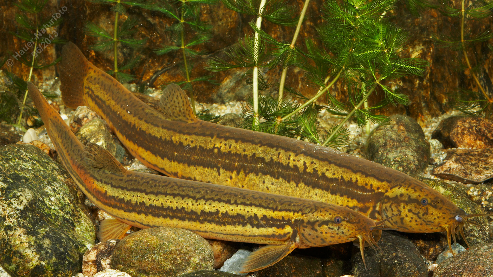

# Schlammpeitzger (Bissgurre)

**Lateinischer Name:** *Misgurnus fossilis*

## Allgemeine Informationen

### Schonzeit
**Ganzjährig geschont!**

### Brittelmaß
Keines (da ganzjährig geschont)

## Merkmale und Aussehen

### Wesentliche Merkmale
- **Zehn Barteln** (sechs am Oberkiefer, vier am Unterkiefer)
- Unterständiges Maul
- Walzenförmig, fast drehrund
- Breite dunkelbraune Streifen entlang der Seitenlinie

### Größe
20 cm

## Lebensweise

### Lebensräume
Bodenbewohner stehender und langsam fließender Gewässer mit schlammigem Grund (gräbt sich ein).

### Nahrung
Wirbellose Tiere:
- Insektenlarven
- Würmer

### Verhalten
- Nachtaktiver Bodenfisch
- Kann im Schlamm Trockenzeiten überdauern
- **Darmatmung** (kann atmosphärischen Sauerstoff über den Darm aufnehmen)

## Besonderheiten
Der Schlammpeitzger ist durch seine zehn Barteln und die Fähigkeit zur Darmatmung einzigartig. Er kann atmosphärische Luft schlucken und über den Darm Sauerstoff aufnehmen - eine wichtige Anpassung an sauerstoffarme Gewässer. Bei Trockenheit kann er sich tief in den Schlamm eingraben und dort überdauern. Diese Art ist stark gefährdet und ganzjährig geschont.
