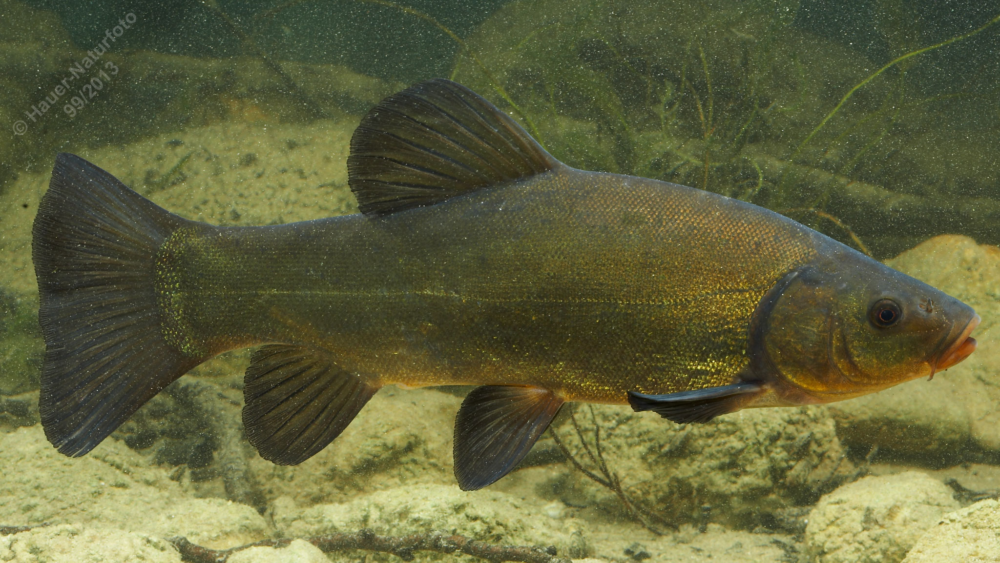

# Schleie

**Lateinischer Name:** *Tinca tinca*

## Allgemeine Informationen

### Schonzeit
1. Mai bis 30. Juni

### Brittelmaß
25 cm

## Merkmale und Aussehen

### Wesentliche Merkmale
- Breites endständiges Maul mit kurzer Maulspalte
- Roter (rotgelber) Augenkreis
- **Je ein Bartfaden in den Maulwinkeln**
- Sehr kleine Schuppen mit dicker Schleimschicht

### Größe
Durchschnittlich 30-35 cm, maximal über 50 cm und über 4 kg

### Alter
Bis 20 Jahre

## Lebensweise

### Lebensräume
Stehende und langsam fließende Gewässer mit weichem Grund und Pflanzenbewuchs.

### Nahrung
- Wirbellose Kleintiere
- Pflanzliches Material

## Besonderheiten
Die Schleie ist durch ihre sehr kleinen Schuppen und die dicke Schleimschicht auf der Haut gut erkennbar (daher auch der Name). Sie hat nur zwei Bartfäden (je einen in den Maulwinkeln) im Gegensatz zu anderen Karpfenartigen. Die Schleie bevorzugt pflanzenreiche Gewässer mit weichem Grund und ist hauptsächlich in der Dämmerung aktiv. Der rötliche Augenkreis ist charakteristisch.
