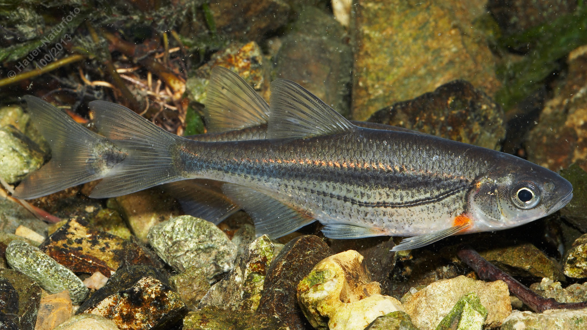

# Schneider (Schusslaube)

**Lateinischer Name:** *Alburnoides bipunctatus*

## Allgemeine Informationen

### Schonzeit
**Ganzjährig geschont!**

### Brittelmaß
Keines (da ganzjährig geschont)

## Merkmale und Aussehen

### Wesentliche Merkmale
- Seitenlinie verläuft mit Knick nach unten
- Breites dunkles Band vom Kopf bis zum Schwanz
- Endständiges Maul
- Bauchseitige Flossen mit rotem Ansatz

### Größe
Durchschnittlich 8-10 cm, selten bis 15 cm

## Lebensweise

### Lebensräume
Klare, schnellfließende Gewässer.

### Nahrung
- Wirbellose Bodentiere
- Anflugnahrung (Insekten von der Oberfläche)

## Besonderheiten
Der Schneider ist ein kleiner Fisch schnellfließender Gewässer. Das charakteristische dunkle Längsband und die mit Knick nach unten verlaufende Seitenlinie machen ihn gut erkennbar. Die roten Ansätze der bauchseitigen Flossen sind ebenfalls typisch. Er ist eine geschützte Art.
