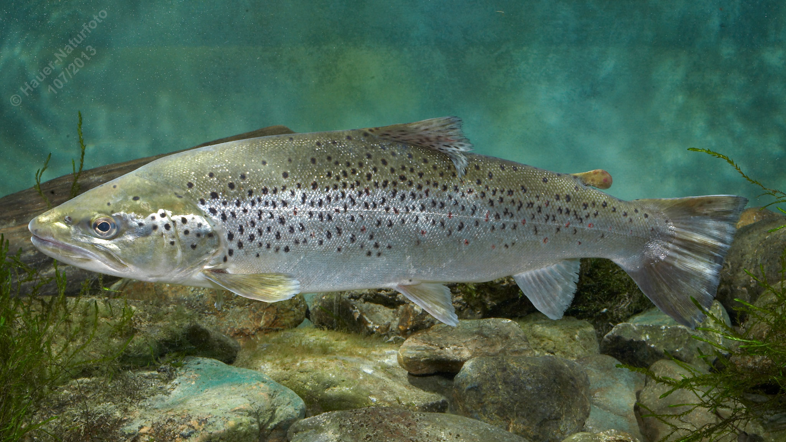

# Seeforelle

**Lateinischer Name:** *Salmo trutta lacustris*

## Allgemeine Informationen

### Schonzeit
16. September bis 15. März

**Abweichende Schonzeit:**
- Attersee, Mondsee, Traunsee: Abweichungen möglich

### Brittelmaß
50 cm

## Merkmale und Aussehen

### Wesentliche Merkmale
- Schwarze sternförmige Flecken am Rücken und an den Seiten
- Fettflosse (typisch für Salmoniden)
- Bei erwachsenen Tieren Schwanzflosse gerade

### Größe
Durchschnittlich 40-80 cm, maximal bis 140 cm und 30 kg

### Alter
8-12 Jahre

## Lebensweise

### Lebensräume
Tiefe Seen des Alpen- und Voralpengebietes. Wandert zum Laichen in Zuflüsse.

### Nahrung
- Jungfisch: Kleintiere
- Im Erwachsenenalter: Ausschließlich Fische

### Fortpflanzung
Die Seeforelle wandert zum Laichen aus den Seen in die Zuflüsse.

## Besonderheiten
Die Seeforelle ist ein Ökotyp der europäischen Forelle (Salmo trutta), speziell angepasst an das Leben in großen, tiefen Seen. Im Gegensatz zur Bachforelle verliert sie im Alter die roten Flecken und entwickelt vorwiegend schwarze sternförmige Flecken. Sie kann sehr groß werden und ist ein reiner Raubfisch.

## Nicht verwechseln!
**Seeforelle:** Größere schwarze Flecken bis zum Bauch, falls rötliche Tupfen vorhanden, dann eher orangefarben ohne Rand  
**Bachforelle:** Kräftige rote Tupfen mit heller Umrandung
