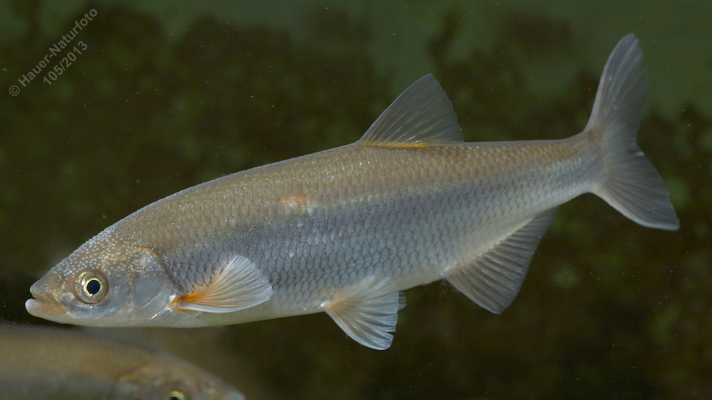

# Seelaube (Mairenke, Schiedling)

**Lateinischer Name:** *Alburnus mento*

## Allgemeine Informationen

### Schonzeit
16. Mai bis 30. Juni

### Brittelmaß
20 cm

## Merkmale und Aussehen

### Wesentliche Merkmale
- Oberständiges Maul mit **verdicktem Unterkiefer**
- Rückenflosse endet beim Beginn der Afterflosse
- Langgestreckt
- Kielförmiger Bauch nur zum Teil mit Schuppen bedeckt
- Rücken- und Schwanzflosse dunkel

### Größe
Durchschnittlich 20 cm, maximal über 30 cm

## Lebensweise

### Lebensräume
Vorwiegend Seen, aber auch Seezuflüsse und -ausrinnen.

### Nahrung
- Planktontiere
- Insektenlarven
- Anflugnahrung (Insekten von der Oberfläche)

## Besonderheiten
Die Seelaube ist eng verwandt mit der Laube, aber größer und an das Leben in Seen angepasst. Der verdickte Unterkiefer und die nur teilweise mit Schuppen bedeckte Bauchkante sind charakteristisch. Sie lebt vorwiegend im Freiwasser von Voralpenseen.
